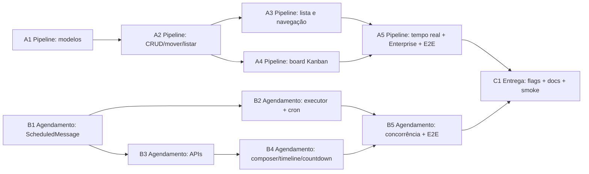

# Pipelines (Kanban) e Mensagens Agendadas — Plano de Implementação

> **For agentic workers:** REQUIRED SUB-SKILL: Use superpowers:subagent-driven-development (recommended) or superpowers:executing-plans to implement this plan task-by-task. Steps use checkbox (`- [ ]`) syntax for tracking.

**Goal:** Implementar pipelines (kanban) por conta — onde a conversa é o card, com etapas ordenadas, board com drag & drop acessível e movimentação em tempo real — e mensagens agendadas por conversa com executor idempotente (at-most-once) em cron minuto-a-minuto, ambos atrás de feature flags por conta, no OSS + Enterprise.

**Architecture:** Trilha A (pipelines): modelos `Pipeline`/`PipelineStage` + colunas `pipeline_stage_id`/`pipeline_stage_changed_at` em `Conversation`; APIs REST account-scoped (CRUD de pipelines/etapas, ação dedicada `POST /conversations/:id/pipeline_stage` para mover, listagem por etapa via `Conversations::FilterService`); frontend em lista + board com DnD HTML5 nativo e ActionCable via `list_of_keys`. Trilha B (agendamento): modelo `ScheduledMessage` com lifecycle `pending → processing → executing → sent/failed/cancelled` espelhando `AutomationRulePendingExecution` (claim atômico, retries limitados, purge de terminais); sweep `ScheduledMessages::TriggerDueJob` em cron dedicado minuto-a-minuto enfileira `ProcessScheduledMessageJob`, que cria a `Message` real na mesma transação que commita `sent` (rollback → reclaim por stale) e reabre conversa resolvida via `conversation.open!`. C1 entrega: flags `pipeline`/`scheduled_messages` habilitadas na conta de teste, smoke test manual documentado, suíte E2E final e remoção de código morto. As duas trilhas são independentes até C1.

**Tech Stack:** Ruby on Rails 7.1.5.2 (RSpec, Sidekiq + sidekiq-cron via `config/schedule.yml`), PostgreSQL, ActionCable; frontend Vue 3 (`<script setup>`) + Vitest + Playwright (`tests/playwright/`); feature flags via `Featurable` (bitmask `feature_flags_ext_1`).

## Global Constraints

Copiadas da spec `docs/superpowers/specs/2026-08-05-pipelines-e-mensagens-agendadas-design.md` (aprovada). Toda tarefa herda implicitamente esta seção.

- **Card é `Conversation`** (D1): sem `PipelineItem`; não há card sem conversa, nem reentrada pós-conclusão.
- **`conversation.pipeline_stage_id` (FK nullable) + `pipeline_stage_changed_at`** (D2); pipeline derivado da etapa (D3) — **não** criar `conversation.pipeline_id`.
- **Etapas padrão por pipeline novo** (D6): Pendente, Follow-up, Proposta, Finalizado, criadas na transação de criação; renomeáveis, reordenáveis, excluíveis (409 com contagem se houver conversas), adicionáveis.
- **Mover etapa não altera** `status`, labels, inbox, assignee nem `snoozed_until` (D5).
- **Ordenação da coluna**: `pipeline_stage_changed_at ASC` (FIFO); sem reordenação persistida dentro da coluna (invariante 6).
- **`ScheduledMessage` separado** (D7), texto somente, sem anexos/mentions/recorrência; **execução cria `Message` real** via `Messages::MessageBuilder` + `SendReplyJob` (callback real de `Message#after_create_commit`, **nunca** chamar `message.send_reply` nem `toggle_status` manualmente — dupla enqueue / duplo toggle).
- **Editar/cancelar apenas enquanto `pending`** (D8); fora disso a API responde **409 com o estado atual**.
- **Conversa resolvida no fire-time: envia e reabre** via `conversation.open!` explícito, dentro da mesma transação que cria a `Message` (D9). Não usar controller nem `toggle_status`.
- **At-most-once** (D10): claim `with_lock` atômico; `executing` só existe dentro da transação que commita `sent`; retry pós-commit encontra terminal e **não recria**; purge de terminais (`sent`/`cancelled`/`failed`) após 30 dias em `in_batches(of: 1000)`.
- **Feature flags `pipeline` e `scheduled_messages`** em `config/features.yml`, coluna `feature_flags_ext_1`, `enabled: false` (padrão `delayed_automations`, linhas 271-274); verificação via `account.feature_enabled?('pipeline')`/`('scheduled_messages')`; instalação sem flag → 404/403 consistente.
- **Multitenancy**: toda query nova parte de `account_id`; recurso de outra conta → 404.
- **Permissões**: gestão de pipelines/etapas → role `admin` da conta; mover card e agendar → qualquer agente com acesso à conversa (guards atuais do controller de conversas + `Conversations::PermissionFilterService`, que no Enterprise aplica `conversation_manage > conversation_unassigned_manage > conversation_participating_manage` automaticamente).
- **Timezone**: `scheduled_at` sempre UTC no banco; API recebe/devolve ISO-8601 com offset (ex.: `2026-08-05T14:30:00-03:00`); validação server-side `scheduled_at > Time.current` é a autoritativa.
- **Sidekiq**: entrada **dedicada** `scheduled_messages_trigger_due_job` em `config/schedule.yml` com cron `'*/1 * * * *'`, classe `ScheduledMessages::TriggerDueJob`, queue `scheduled_jobs` (padrão `trigger_imap_email_inboxes_job`, linhas 24-27); **não** alterar `TriggerScheduledItemsJob` (cron `*/5`).
- **Enterprise** (AGENTS.md): extensões enterprise via `prepend_mod_with`, nunca edição direta de OSS. Único acoplamento no MVP: `enterprise/app/models/enterprise/conversation.rb` recebe `pipeline_stage_id` no `list_of_keys` (`super + %w[sla_policy_id pipeline_stage_id]`).
- **i18n**: strings de UI somente via arquivos de locale em inglês (`en.yml`/`en.json`/árvore `locale/en`); outros idiomas via Crowdin; sem strings soltas; `replaceInstallationName` onde couber branding.
- **Migrations**: uma migration por tabela, sem backfill (colunas nullable, recurso novo).
- **Testes**: RSpec com `let` diretos (sem helpers custom de setup), `with_modified_env` para ENV, comparar `error.class.name` em specs paralelas; frontend com Vitest (`pnpm test <arquivo>`); E2E com Playwright em `tests/playwright/tests/e2e/ui/`.
- **Sem dependências novas**; DnD HTML5 nativo (sem biblioteca); `prefers-reduced-motion` desabilita animações.
- **Fora de escopo (MVP)**: `PipelineItem`, valor/ganhos/produtos/forecast/`pipeline_type`, página global de agendamentos, recorrência, templates/anexos/mentions em mensagens agendadas, `execute_webhook`/`create_task`/`send_email`, automações de inatividade por estágio, reordenação manual persistida intra-coluna, histórico `StageMovement`, permissões finas por pipeline/etapa, SLA por etapa, relatórios de funil/CSV, `reschedule_paused`, janela de expiração de `scheduled_at`, métricas novas.
- **Não contornar `prevent_message_flooding`** (1 msg/min/conversa): falha do `MessageBuilder` → rollback sem criar `Message` → caminho de retries limitados → `failed`.
- **Falha de canal**: segue o caminho existente de mensagens (`messages#retry`/`StatusUpdateService`); `ScheduledMessage` já está `sent` e não tem nova lógica.

## DAG e Waves (paralelismo)

Dependências estritas (arestas `depende de`), sem dependências laterais entre as trilhas A e B até C1:



| Wave | Tarefas | Pré-requisitos | Paralelismo real |
|------|---------|----------------|------------------|
| Wave 0 | A1, B1 | nenhum | A1 ∥ B1 (raízes independentes) |
| Wave 1 | A2, B2, B3 | A1 (→A2), B1 (→B2, →B3) | A2 ∥ B2 ∥ B3 — três workers |
| Wave 2 | A3, A4, B4 | A2 (→A3, →A4), B3 (→B4) | A3 ∥ A4 ∥ B4 — três workers; B4 pode começar assim que B3 existir, sem esperar B2 |
| Wave 3 | A5, B5 | A3+A4 (→A5), B2+B4 (→B5) | A5 ∥ B5 — dois workers |
| Wave 4 | C1 | A5+B5 | único worker |

Regra de ouro para despacho paralelo: A3/A4 **nunca** começam antes de A2 (a API não existe); B4 **nunca** começa antes de B3 (as rotas não existem); B5 **nunca** antes de B2 (o executor não existe). Dentro de uma wave, as tarefas não compartilham arquivos entre si (ver Mapa de Arquivos — cada trilha toca arquivos próprios; a única sobreposição é `config/features.yml` (A1 adiciona `pipeline`, B1 adiciona `scheduled_messages` — edições em blocos distintos, sem conflito) e `config/routes.rb` (A2 e B3 adicionam blocos em escopos distintos — coordenar via commit sequencial dentro da wave).

## Mapa de Arquivos e Responsabilidades

### Trilha A — Pipelines (backend)

| Arquivo | Criado/Modificado | Responsabilidade |
|---------|-------------------|------------------|
| `db/migrate/*_create_pipelines.rb` | criar | Tabela `pipelines` (`account_id`, `name`, `description`, `archived_at`, timestamps) |
| `db/migrate/*_create_pipeline_stages.rb` | criar | Tabela `pipeline_stages` (`pipeline_id`, `name`, `position` único por pipeline, `color`, timestamps) |
| `db/migrate/*_add_pipeline_stage_to_conversations.rb` | criar | `pipeline_stage_id` (FK nullable, indexado) + `pipeline_stage_changed_at` em `conversations` |
| `app/models/pipeline.rb` | criar | Conta-scoped; cria 4 etapas padrão na transação; `active`/`archived`; `archive!` |
| `app/models/pipeline_stage.rb` | criar | `position` único por pipeline; cor hex; bloqueia destroy com conversas; `with_conversations_count`; `reorder!` |
| `app/models/conversation.rb` | modificar | `belongs_to :pipeline_stage`, validação cross-account, callback `pipeline_stage_changed_at`, `list_of_keys` + `pipeline_stage_id`, `move_to_stage!` |
| `enterprise/app/models/enterprise/conversation.rb` | modificar | `list_of_keys` → `super + %w[sla_policy_id pipeline_stage_id]` |
| `config/features.yml` | modificar | Flags `pipeline` (A1) e `scheduled_messages` (B1) — fim da lista, `column: feature_flags_ext_1`, `enabled: false` |
| `app/controllers/api/v1/accounts/pipelines_controller.rb` | criar | CRUD account-scoped + arquivamento; gate flag; admin |
| `app/controllers/api/v1/accounts/pipeline_stages_controller.rb` | criar | Criar/renomear/reordenar/excluir etapa (409 com contagem) + member `conversations` (coluna do board) |
| `app/controllers/api/v1/accounts/conversations_controller.rb` | modificar | Member action `pipeline_stage` (mover card, ação dedicada) |
| `app/services/conversations/stage_filter_service.rb` | criar | Subclasse de `Conversations::FilterService` com base stage-scoped, busca `q` e ordenação FIFO |
| `app/serializers/pipeline_serializer.rb` | criar | `id`, `name`, `description`, `archived_at`, `stages` |
| `app/serializers/pipeline_stage_serializer.rb` | criar | `id`, `name`, `position`, `color`, `conversations_count` |
| `app/serializers/conversation_serializer.rb` | modificar | Expõe `pipeline_stage_id`, `pipeline_stage_changed_at`, `pending_scheduled_message_count` |

### Trilha B — Agendamento (backend)

| Arquivo | Criado/Modificado | Responsabilidade |
|---------|-------------------|------------------|
| `db/migrate/*_create_scheduled_messages.rb` | criar | Tabela `scheduled_messages` com índices `(status, scheduled_at)` e `(conversation_id)` |
| `app/models/conversation.rb` | modificar | `has_many :scheduled_messages` (responsabilidade B1) |
| `app/models/scheduled_message.rb` | criar | Lifecycle, claim!, cancel!, retry manual, scopes `sweepable`/`for_enabled_accounts`/`expired_terminal`, `purge_terminal!` |
| `app/validators/scheduled_at_validator.rb` | criar | `scheduled_at > Time.current` (server-side, autoritativo) |
| `lib/events/types.rb` | modificar | `SCHEDULED_MESSAGE_CREATED`/`UPDATED`/`CANCELLED` |
| `app/jobs/scheduled_messages/trigger_due_job.rb` | criar | Sweep minuto-a-minuto: purge + rows due (cap 1000) + enfileira workers |
| `app/jobs/scheduled_messages/process_scheduled_message_job.rb` | criar | Claim → re-check → transação `executing`/`open!`/`MessageBuilder`/`sent` → retries limitados → `failed` |
| `config/schedule.yml` | modificar | Entrada dedicada `scheduled_messages_trigger_due_job` (cron `'*/1 * * * *'`) |
| `app/controllers/api/v1/accounts/conversations/scheduled_messages_controller.rb` | criar | Index/create/update/destroy(cancel)/retry aninhados por conversa; gate flag |
| `app/serializers/scheduled_message_serializer.rb` | criar | `content`, `scheduled_at` ISO-8601 com offset da conta, `status`, `internal_note`, `created_by`, `message_id`, `sent_at`, `error` |

### Frontend (A3/A4/B4)

| Arquivo | Criado/Modificado | Responsabilidade |
|---------|-------------------|------------------|
| `app/javascript/dashboard/routes/dashboard/pipelines/pipelines.routes.js` | criar | Rotas `/pipelines` (lista) e `/pipelines/:pipelineId` (board) |
| `app/javascript/dashboard/routes/dashboard/pipelines/PipelinesIndex.vue` | criar | Lista: header + "Novo pipeline", busca, tabela, empty/loading/error, arquivados |
| `app/javascript/dashboard/routes/dashboard/pipelines/PipelineFormModal.vue` | criar | Modal criar/editar pipeline (nome + descrição) |
| `app/javascript/dashboard/routes/dashboard/pipelines/PipelineBoard.vue` | criar | Board: colunas 280px, DnD nativo, filtros, busca, paginação, drawer 480px |
| `app/javascript/dashboard/routes/dashboard/pipelines/PipelineBoardColumn.vue` | criar | Coluna: header (cor/nome editável inline/contador/+ /⋯), lista de cards, placeholder "+ Adicionar etapa" |
| `app/javascript/dashboard/routes/dashboard/pipelines/PipelineBoardCard.vue` | criar | Card = conversa: avatar, nome, snippet 2 linhas, timestamp, badge status, dias no estágio, sino se agendamento pendente; acessível por teclado |
| `app/javascript/dashboard/routes/dashboard/dashboard.routes.js` | modificar | Registrar `pipelines.routes` |
| `app/javascript/dashboard/components-next/sidebar/Sidebar.vue` | modificar | Item "Pipelines" entre "Conversas" e "Contatos" |
| `app/javascript/dashboard/components/widgets/conversation/ReplyBox.vue` | modificar | Botão "Agendar" (texto presente, sem anexo), abre modal, card de countdown acima do composer |
| `app/javascript/dashboard/components/widgets/conversation/scheduled_messages/ScheduledMessageModal.vue` | criar | Modal agendar/editar: mensagem read-only, `datetime-local`, observação 500 chars, validações, estados |
| `app/javascript/dashboard/components/widgets/conversation/scheduled_messages/ScheduledMessageCard.vue` | criar | Card "Próxima mensagem agendada" com countdown ao vivo, Editar/Cancelar |
| `app/javascript/dashboard/routes/dashboard/conversation/ConversationView.vue` | modificar | Item de timeline "📅 [Agente] agendou…", estado enviado/falhou/cancelado, "Tentar novamente" |
| `app/javascript/dashboard/helper/actionCable.js` | modificar | Handlers `scheduled_message.created/updated/cancelled` |
| `app/javascript/dashboard/api/pipelines.js`, `api/conversations.js`, `api/scheduledMessages.js` | criar/modificar | Clientes de API do frontend |
| `app/javascript/dashboard/i18n/locale/en/pipelines.json` | criar | Strings da lista/board (verificar loader em `app/javascript/dashboard/i18n/index.js`; se o loader exigir registro manual, seguir o padrão existente) |
| `app/javascript/dashboard/i18n/locale/en/conversation.json` | modificar | Strings do composer/modal/card de agendamento |

### Testes E2E e entrega

| Arquivo | Criado | Responsabilidade |
|---------|--------|------------------|
| `tests/playwright/tests/e2e/ui/pipelines-board.spec.ts` | criar (A5) | Fluxo E2E completo do board |
| `tests/playwright/tests/e2e/ui/scheduled-messages.spec.ts` | criar (B5) | Fluxo E2E completo de agendamento |
| `docs/superpowers/smoke/2026-08-05-pipelines-e-mensagens-agendadas.md` | criar (C1) | Smoke test manual (§11 da spec) |

---

## Task A1: [Pipeline] Modelar pipelines e etapas

**Files:**
- Create: `db/migrate/<timestamp>_create_pipelines.rb`, `db/migrate/<timestamp>_create_pipeline_stages.rb`, `db/migrate/<timestamp>_add_pipeline_stage_to_conversations.rb`
- Create: `app/models/pipeline.rb`, `app/models/pipeline_stage.rb`
- Modify: `app/models/conversation.rb` (blocos `belongs_to`/validação/callback/`list_of_keys`/`move_to_stage!`), `enterprise/app/models/enterprise/conversation.rb`, `config/features.yml`
- Test: `spec/models/pipeline_spec.rb`, `spec/models/pipeline_stage_spec.rb`, `spec/models/conversation_spec.rb` (adições), `spec/enterprise/models/conversation_spec.rb` (ou arquivo enterprise espelhando, seguir a árvore `spec/enterprise/` existente)

**Interfaces:**
- Consumes: nada (raiz da trilha A). Referências de padrão: `app/models/automation_rule_pending_execution.rb` (enum/escopos), `Featurable` (`app/models/concerns/featurable.rb`), `Account#feature_pipeline` (gerado por `has_flags` a partir de `config/features.yml`).
- Produces:
  - `Pipeline` — `belongs_to :account`; `has_many :pipeline_stages, dependent: :destroy`; `Pipeline::DEFAULT_STAGES` (4 hashes `{ name:, color: }`); `Pipeline.active`/`Pipeline.archived`; `#archive!` (`update!(archived_at: Time.current)`); `#archived?`. Criar pipeline cria as 4 etapas padrão na mesma transação.
  - `PipelineStage` — `belongs_to :pipeline`; `has_many :conversations, foreign_key: :pipeline_stage_id, dependent: :nullify`; `PipelineStage.with_conversations_count`; `#reorder!(new_position)`; `#conversations_count` (atributo da subquery).
  - `Conversation` — `belongs_to :pipeline_stage, class_name: 'PipelineStage', optional: true, inverse_of: :conversations`; `#move_to_stage!(stage)`; `list_of_keys` inclui `'pipeline_stage_id'`; validação cross-account; callback `pipeline_stage_changed_at` em toda mudança de `pipeline_stage_id`.
  - Flag `pipeline` registrada em `config/features.yml` (coluna `feature_flags_ext_1`), habilitável via `account.enable_features!(:pipeline)`.

- [ ] **Step 1: Escrever os testes que falham**

`spec/models/pipeline_spec.rb`:
```ruby
require 'rails_helper'

RSpec.describe Pipeline do
  let(:account) { create(:account) }

  describe 'criação com etapas padrão' do
    it 'cria as 4 etapas padrão na mesma transação' do
      pipeline = described_class.create!(account: account, name: 'Vendas')
      expect(pipeline.pipeline_stages.pluck(:name)).to eq(%w[Pendente Follow-up Proposta Finalizado])
      expect(pipeline.pipeline_stages.pluck(:position)).to eq([1, 2, 3, 4])
    end
  end

  describe 'arquivamento' do
    it 'esconde da lista mas não desassocia conversas' do
      pipeline = create(:pipeline, account: account)
      conversation = create(:conversation, account: account, pipeline_stage: pipeline.pipeline_stages.first)
      pipeline.archive!
      expect(described_class.active).not_to include(pipeline)
      expect(conversation.reload.pipeline_stage_id).to eq(pipeline.pipeline_stages.first.id)
    end
  end
end
```

`spec/models/pipeline_stage_spec.rb`:
```ruby
require 'rails_helper'

RSpec.describe PipelineStage do
  let(:pipeline) { create(:pipeline) }

  describe 'position único por pipeline' do
    it 'rejeita position duplicada no mesmo pipeline' do
      duplicate = pipeline.pipeline_stages.build(name: 'Duplicada', position: 1, color: '#000000')
      expect(duplicate).not_to be_valid
      expect(duplicate.errors[:position]).to be_present
    end
  end

  describe 'exclusão' do
    it 'bloqueia exclusão quando há conversas associadas' do
      stage = create(:pipeline_stage, pipeline: pipeline, position: 1)
      create(:conversation, account: pipeline.account, pipeline_stage: stage)
      expect(stage.destroy).to be(false)
      expect(stage.errors[:base]).to be_present
    end
  end

  describe 'reorder!' do
    it 'renumera os irmãos após mover' do
      stages = create_list(:pipeline_stage, 3, pipeline: pipeline)
      stages.each_with_index { |s, i| s.update_column(:position, i + 1) }
      stages.first.reorder!(3)
      expect(pipeline.pipeline_stages.order(:position).pluck(:position)).to eq([1, 2, 3])
      expect(pipeline.pipeline_stages.order(:position).last).to eq(stages.first)
    end
  end

  describe 'with_conversations_count' do
    it 'retorna contagem por subquery' do
      stage = create(:pipeline_stage, pipeline: pipeline, position: 1)
      create(:conversation, account: pipeline.account, pipeline_stage: stage)
      counted = described_class.with_conversations_count.find(stage.id)
      expect(counted.conversations_count).to eq(1)
    end
  end
end
```

Adições em `spec/models/conversation_spec.rb` (dentro do describe existente):
```ruby
describe 'pipeline stage' do
  let(:account) { create(:account) }
  let(:conversation) { create(:conversation, account: account) }

  it 'valida que a etapa pertence à mesma conta' do
    other_stage = create(:pipeline_stage, pipeline: create(:pipeline))
    conversation.pipeline_stage = other_stage
    expect(conversation).not_to be_valid
    expect(conversation.errors[:pipeline_stage]).to be_present
  end

  it 'atualiza pipeline_stage_changed_at em toda mudança de etapa' do
    stage = create(:pipeline_stage, pipeline: create(:pipeline, account: account))
    conversation.update!(pipeline_stage: stage)
    first_change = conversation.pipeline_stage_changed_at
    travel_to(1.hour.from_now) do
      conversation.move_to_stage!(create(:pipeline_stage, pipeline: create(:pipeline, account: account), position: 2))
    end
    expect(conversation.pipeline_stage_changed_at).to be > first_change
  end

  it 'move_to_stage! não altera status, labels, inbox nem assignee' do
    inbox = create(:inbox, account: account)
    conversation.update!(inbox: inbox, assignee: create(:user, account: account))
    conversation.move_to_stage!(create(:pipeline_stage, pipeline: create(:pipeline, account: account)))
    expect(conversation.reload).to have_attributes(status: 'open', inbox_id: inbox.id)
    expect(conversation.assignee).to be_present
  end

  it 'list_of_keys inclui pipeline_stage_id' do
    expect(conversation.list_of_keys).to include('pipeline_stage_id')
  end
end
```

Spec enterprise (espelhar em `spec/enterprise/` seguindo a árvore existente; se não houver spec enterprise de conversation, criar `spec/enterprise/models/conversation_spec.rb`):
```ruby
require 'rails_helper'

RSpec.describe 'Enterprise::Conversation' do
  it 'inclui sla_policy_id e pipeline_stage_id no list_of_keys' do
    conversation = build(:conversation)
    keys = conversation.list_of_keys
    expect(keys).to include('sla_policy_id', 'pipeline_stage_id')
  end
end
```

- [ ] **Step 2: Rodar os testes para verificar que falham**

Run: `bundle exec rspec spec/models/pipeline_spec.rb spec/models/pipeline_stage_spec.rb spec/models/conversation_spec.rb`
Expected: `NameError: uninitialized constant Pipeline` (fábricas/pipeline ausente) — falha real.

- [ ] **Step 3: Gerar as migrations**

Run:
```bash
bundle exec rails generate migration CreatePipelines
bundle exec rails generate migration CreatePipelineStages
bundle exec rails generate migration AddPipelineStageToConversations
```
Use os timestamps gerados. Preencher o conteúdo conforme Step 4.

- [ ] **Step 4: Escrever as migrations**

`db/migrate/<ts>_create_pipelines.rb`:
```ruby
class CreatePipelines < ActiveRecord::Migration[7.1]
  def change
    create_table :pipelines do |t|
      t.references :account, null: false, foreign_key: true, index: true
      t.string :name, null: false
      t.text :description
      t.datetime :archived_at

      t.timestamps
    end
  end
end
```

`db/migrate/<ts>_create_pipeline_stages.rb`:
```ruby
class CreatePipelineStages < ActiveRecord::Migration[7.1]
  def change
    create_table :pipeline_stages do |t|
      t.references :pipeline, null: false, foreign_key: true, index: true
      t.string :name, null: false
      t.integer :position, null: false
      t.string :color, null: false, default: '#2563eb'

      t.timestamps
    end
    add_index :pipeline_stages, [:pipeline_id, :position], unique: true
  end
end
```

`db/migrate/<ts>_add_pipeline_stage_to_conversations.rb`:
```ruby
class AddPipelineStageToConversations < ActiveRecord::Migration[7.1]
  def change
    add_reference :conversations, :pipeline_stage, null: true, foreign_key: { to_table: :pipeline_stages }
    add_column :conversations, :pipeline_stage_changed_at, :datetime
  end
end
```

- [ ] **Step 5: Rodar a migration**

Run: `bundle exec rails db:migrate`
Expected: 3 migrations aplicadas sem erro (verificar com `bundle exec rails db:migrate:status`).

- [ ] **Step 6: Registrar a flag `pipeline`**

Adicionar ao final de `config/features.yml` (após o bloco `delayed_automations`, linhas 271-274):
```yaml
- name: pipeline
  display_name: Pipelines
  enabled: false
  column: feature_flags_ext_1
```
Verificar: `bundle exec rails runner 'puts Account.new.feature_pipeline?'` → `false`.

- [ ] **Step 7: Escrever os modelos**

`app/models/pipeline.rb`:
```ruby
class Pipeline < ApplicationRecord
  belongs_to :account
  has_many :pipeline_stages, dependent: :destroy

  validates :name, presence: true

  scope :active, -> { where(archived_at: nil) }
  scope :archived, -> { where.not(archived_at: nil) }

  DEFAULT_STAGES = [
    { name: 'Pendente', color: '#2563eb' },
    { name: 'Follow-up', color: '#f59e0b' },
    { name: 'Proposta', color: '#8b5cf6' },
    { name: 'Finalizado', color: '#10b981' }
  ].freeze

  after_create :create_default_stages

  def archive!
    update!(archived_at: Time.current)
  end

  def archived?
    archived_at.present?
  end

  private

  # after_create roda dentro da transação do create!, então as etapas
  # padrão são criadas atomicamente com o pipeline (D6).
  def create_default_stages
    DEFAULT_STAGES.each_with_index do |stage, index|
      pipeline_stages.create!(name: stage[:name], position: index + 1, color: stage[:color])
    end
  end
end
```

`app/models/pipeline_stage.rb`:
```ruby
class PipelineStage < ApplicationRecord
  belongs_to :pipeline
  has_many :conversations, foreign_key: :pipeline_stage_id, dependent: :nullify, inverse_of: :pipeline_stage

  validates :name, presence: true
  validates :position, presence: true, uniqueness: { scope: :pipeline_id }
  validates :color, format: { with: /\A#[0-9a-fA-F]{6}\z/ }

  before_destroy :prevent_destroy_with_conversations

  scope :ordered, -> { order(:position) }

  # Contagem por subquery para evitar N+1 na listagem de pipelines.
  scope :with_conversations_count, lambda {
    select('pipeline_stages.*, (SELECT COUNT(*) FROM conversations
            WHERE conversations.pipeline_stage_id = pipeline_stages.id) AS conversations_count')
  }

  # Exclusão com conversas é bloqueada no modelo e responde 409 na API (com contagem).
  def prevent_destroy_with_conversations
    return if conversations.none?

    errors.add(:base, "cannot delete stage with #{conversations.count} conversations")
    throw :abort
  end

  # Reordenação: sentinela 0 é seguro porque posições começam em 1.
  def reorder!(new_position)
    pipeline.pipeline_stages.transaction do
      update_column(:position, 0)
      pipeline.pipeline_stages.where.not(id: id).where('position >= ?', new_position).order(:position).each do |stage|
        stage.update_column(:position, stage.position + 1)
      end
      update_column(:position, new_position)
    end
  end
end
```

- [ ] **Step 8: Alterar `Conversation`**

Em `app/models/conversation.rb`:
- Junto aos outros `belongs_to`:
```ruby
belongs_to :pipeline_stage, class_name: 'PipelineStage', optional: true, inverse_of: :conversations
```
- Validação + callback + método (próximo de outras validações/callbacks):
```ruby
validate :pipeline_stage_belongs_to_account
before_update :set_pipeline_stage_changed_at, if: :pipeline_stage_id_changed?

def move_to_stage!(stage)
  update!(pipeline_stage: stage)
end

private

def pipeline_stage_belongs_to_account
  return if pipeline_stage.nil? || pipeline_stage.pipeline.account_id == account_id

  errors.add(:pipeline_stage, 'must belong to the same account')
end

# Invariante 3: base do "dias no estágio" e da ordenação FIFO da coluna.
def set_pipeline_stage_changed_at
  self.pipeline_stage_changed_at = Time.current
end
```
- Em `list_of_keys` (linhas 338-341), adicionar `pipeline_stage_id`:
```ruby
def list_of_keys
  %w[team_id assignee_id assignee_agent_bot_id status snoozed_until custom_attributes label_list waiting_since
     first_reply_created_at priority pipeline_stage_id]
end
```

Em `enterprise/app/models/enterprise/conversation.rb`:
```ruby
def list_of_keys
  super + %w[sla_policy_id pipeline_stage_id]
end
```

- [ ] **Step 9: Rodar os testes para verificar que passam**

Run: `bundle exec rspec spec/models/pipeline_spec.rb spec/models/pipeline_stage_spec.rb spec/models/conversation_spec.rb spec/enterprise/models/conversation_spec.rb`
Expected: todos PASS (criar factory `pipeline`/`pipeline_stage` em `spec/factories/` se ainda não existirem — seguir o padrão das factories existentes).

- [ ] **Step 10: Commit**

```bash
git add db/migrate config/features.yml app/models/pipeline.rb app/models/pipeline_stage.rb app/models/conversation.rb enterprise/app/models/enterprise/conversation.rb spec/models/pipeline_spec.rb spec/models/pipeline_stage_spec.rb spec/models/conversation_spec.rb spec/enterprise
git commit -m "feat: add Pipeline and PipelineStage models with Conversation integration"
```

---

## Task A2: [Pipeline] Expor CRUD, movimentação e listagem por etapa

**Files:**
- Modify: `config/routes.rb` (blocos `resources :pipelines` + member `pipeline_stage` em conversations)
- Create: `app/controllers/api/v1/accounts/pipelines_controller.rb`, `app/controllers/api/v1/accounts/pipeline_stages_controller.rb`, `app/services/conversations/stage_filter_service.rb`, `app/serializers/pipeline_serializer.rb`, `app/serializers/pipeline_stage_serializer.rb`
- Modify: `app/controllers/api/v1/accounts/conversations_controller.rb`, `app/serializers/conversation_serializer.rb`
- Test: `spec/controllers/api/v1/accounts/pipelines_controller_spec.rb`, `spec/services/conversations/stage_filter_service_spec.rb`

**Interfaces:**
- Consumes: `Pipeline`/`PipelineStage`/`Conversation#move_to_stage!`/`pipeline_stage_changed_at`/`list_of_keys` (A1); `Conversations::FilterService` (`app/services/conversations/filter_service.rb`, `new(params, user, account).perform` → `{ conversations:, count: }`); `Conversations::PermissionFilterService` (aplicado dentro do FilterService); `Featurable#feature_enabled?`; guard de admin (`Current.user.administrator?`).
- Produces:
  - Rotas: `GET/POST /api/v1/accounts/:account_id/pipelines`, `GET/PATCH/DELETE .../pipelines/:id`, `POST .../pipelines/:id/stages`, `PATCH/DELETE .../pipelines/:id/stages/:stage_id`, `GET .../pipelines/:id/stages/:stage_id/conversations`, `POST .../conversations/:conversation_id/pipeline_stage`.
  - `Api::V1::Accounts::PipelinesController` — actions `index`, `create`, `show`, `update`, `destroy` (arquiva).
  - `Api::V1::Accounts::PipelineStagesController` — actions `create`, `update`, `destroy`, `conversations`.
  - `ConversationsController#pipeline_stage` (member) — move o card; valida cross-account (404); `pipeline_stage_changed_at` atualizado; `CONVERSATION_UPDATED` via `list_of_keys`.
  - `Conversations::StageFilterService < Conversations::FilterService` — `initialize(params, user, account, stage)`, filtra na base da etapa, `q` busca nome/email/telefone/snippet, ordena `pipeline_stage_changed_at ASC`.
  - `PipelineSerializer` (`id`, `name`, `description`, `archived_at`, `stages`), `PipelineStageSerializer` (`id`, `name`, `position`, `color`, `conversations_count`), `ConversationSerializer` com `pipeline_stage_id`/`pipeline_stage_changed_at`.

- [ ] **Step 1: Escrever os testes que falham**

`spec/controllers/api/v1/accounts/pipelines_controller_spec.rb` (padrão dos specs de controller existentes: `create(:account_user, account:, user:, role: :administrator)`; usar `let` diretos):
```ruby
require 'rails_helper'

RSpec.describe 'Api::V1::Accounts::PipelinesController', type: :request do
  let(:account) { create(:account) }
  let(:agent) { create(:user, account: account) }
  let(:admin) { create(:user, account: account) }

  before do
    account.enable_features!(:pipeline)
    create(:account_user, account: account, user: agent, role: :agent)
    create(:account_user, account: account, user: admin, role: :administrator)
  end

  describe 'GET /api/v1/accounts/:account_id/pipelines' do
    it 'lista pipelines ativos com contagens' do
      pipeline = create(:pipeline, account: account)
      stage = pipeline.pipeline_stages.first
      create(:conversation, account: account, pipeline_stage: stage)

      get "/api/v1/accounts/#{account.id}/pipelines", headers: admin.create_new_auth_token, as: :json
      expect(response).to have_http_status(:success)
      body = response.parsed_body
      expect(body.first['name']).to eq(pipeline.name)
      expect(body.first['stages'].map { |s| s['conversations_count'] }.sum).to eq(1)
    end
  end

  describe 'POST /api/v1/accounts/:account_id/pipelines' do
    it 'cria pipeline com 4 etapas padrão' do
      post "/api/v1/accounts/#{account.id}/pipelines", params: { name: 'Vendas', description: 'funil' },
           headers: admin.create_new_auth_token, as: :json
      expect(response).to have_http_status(:success)
      expect(response.parsed_body['stages'].pluck('name')).to eq(%w[Pendente Follow-up Proposta Finalizado])
    end

    it 'rejeita agente sem role admin' do
      post "/api/v1/accounts/#{account.id}/pipelines", params: { name: 'X' },
           headers: agent.create_new_auth_token, as: :json
      expect(response).to have_http_status(:forbidden)
    end
  end

  describe 'DELETE /api/v1/accounts/:account_id/pipelines/:id' do
    it 'arquiva em vez de excluir fisicamente' do
      pipeline = create(:pipeline, account: account)
      delete "/api/v1/accounts/#{account.id}/pipelines/#{pipeline.id}", headers: admin.create_new_auth_token, as: :json
      expect(response).to have_http_status(:success)
      expect(pipeline.reload.archived_at).to be_present
      expect(Pipeline.find_by(id: pipeline.id)).to be_present
    end
  end

  describe 'DELETE /api/v1/accounts/:account_id/pipelines/:pipeline_id/stages/:stage_id' do
    it 'responde 409 com contagem quando a etapa tem conversas' do
      pipeline = create(:pipeline, account: account)
      stage = pipeline.pipeline_stages.first
      create(:conversation, account: account, pipeline_stage: stage)

      delete "/api/v1/accounts/#{account.id}/pipelines/#{pipeline.id}/stages/#{stage.id}",
             headers: admin.create_new_auth_token, as: :json
      expect(response).to have_http_status(:conflict)
      expect(response.parsed_body['conversations_count']).to eq(1)
    end
  end

  describe 'POST /api/v1/accounts/:account_id/conversations/:conversation_id/pipeline_stage' do
    it 'move a conversa e atualiza pipeline_stage_changed_at' do
      conversation = create(:conversation, account: account)
      stage = create(:pipeline_stage, pipeline: create(:pipeline, account: account), position: 1)

      post "/api/v1/accounts/#{account.id}/conversations/#{conversation.id}/pipeline_stage",
           params: { pipeline_stage_id: stage.id }, headers: agent.create_new_auth_token, as: :json
      expect(response).to have_http_status(:success)
      expect(conversation.reload.pipeline_stage_id).to eq(stage.id)
      expect(conversation.pipeline_stage_changed_at).to be_present
    end

    it 'responde 404 para etapa de outra conta' do
      conversation = create(:conversation, account: account)
      foreign_stage = create(:pipeline_stage, pipeline: create(:pipeline), position: 1)

      post "/api/v1/accounts/#{account.id}/conversations/#{conversation.id}/pipeline_stage",
           params: { pipeline_stage_id: foreign_stage.id }, headers: agent.create_new_auth_token, as: :json
      expect(response).to have_http_status(:not_found)
    end

    it 'dispara CONVERSATION_UPDATED via list_of_keys' do
      conversation = create(:conversation, account: account)
      stage = create(:pipeline_stage, pipeline: create(:pipeline, account: account), position: 1)
      dispatched = []

      allow(Rails.configuration.dispatcher).to receive(:dispatch) do |event, *_args|
        dispatched << event
      end

      post "/api/v1/accounts/#{account.id}/conversations/#{conversation.id}/pipeline_stage",
           params: { pipeline_stage_id: stage.id }, headers: agent.create_new_auth_token, as: :json
      expect(dispatched).to include(Events::Types::CONVERSATION_UPDATED)
    end
  end
end
```

`spec/services/conversations/stage_filter_service_spec.rb`:
```ruby
require 'rails_helper'

RSpec.describe Conversations::StageFilterService do
  let(:account) { create(:account) }
  let(:agent) { create(:user, account: account) }
  let(:stage) { create(:pipeline_stage, pipeline: create(:pipeline, account: account), position: 1) }
  let(:params) { { payload: [], page: 1 } }

  before { create(:account_user, account: account, user: agent, role: :agent) }

  it 'retorna apenas conversas da etapa, ordenadas por pipeline_stage_changed_at ASC' do
    second = create(:conversation, account: account, pipeline_stage: stage)
    first = create(:conversation, account: account, pipeline_stage: stage)
    first.update_column(:pipeline_stage_changed_at, 1.day.ago)
    create(:conversation, account: account) # fora da etapa

    result = described_class.new(params, agent, account, stage).perform
    expect(result[:conversations].map(&:id)).to eq([first.id, second.id])
  end

  it 'aplica filtro de status via payload' do
    open_conv = create(:conversation, account: account, pipeline_stage: stage, status: :open)
    create(:conversation, account: account, pipeline_stage: stage, status: :resolved)
    params[:payload] = [{ attribute_key: 'status', filter_operator: 'equal_to', values: ['open'], query_operator: 'AND' }]

    result = described_class.new(params, agent, account, stage).perform
    expect(result[:conversations].map(&:id)).to eq([open_conv.id])
  end

  it 'busca por q em nome/email/telefone do contato' do
    conv = create(:conversation, account: account, pipeline_stage: stage)
    conv.contact.update!(name: 'Rafaela Souza')
    params[:q] = 'rafaela'

    result = described_class.new(params, agent, account, stage).perform
    expect(result[:conversations].map(&:id)).to eq([conv.id])
  end
end
```

- [ ] **Step 2: Rodar os testes para verificar que falham**

Run: `bundle exec rspec spec/controllers/api/v1/accounts/pipelines_controller_spec.rb spec/services/conversations/stage_filter_service_spec.rb`
Expected: `ActionController::RoutingError: No route matches` — falha real.

- [ ] **Step 3: Adicionar as rotas**

Em `config/routes.rb`, dentro do `resources :accounts` (mesmo nível de `resources :campaigns`), adicionar:
```ruby
resources :pipelines, only: [:index, :create, :show, :update, :destroy] do
  resources :stages, only: [:create, :update, :destroy], controller: 'pipeline_stages' do
    member do
      get :conversations
    end
  end
end
```
E no bloco `member do` de `resources :conversations` (linhas ~155-170), adicionar:
```ruby
post :pipeline_stage
```

- [ ] **Step 4: Escrever o controller de pipelines**

`app/controllers/api/v1/accounts/pipelines_controller.rb`:
```ruby
class Api::V1::Accounts::PipelinesController < Api::V1::Accounts::BaseController
  before_action :ensure_feature_enabled
  before_action :ensure_administrator, except: [:index, :show]
  before_action :set_pipeline, only: [:show, :update, :destroy]

  def index
    pipelines = current_account.pipelines.active
    render json: pipelines, each_serializer: PipelineSerializer
  end

  def create
    @pipeline = current_account.pipelines.create!(pipeline_params)
    render json: @pipeline, serializer: PipelineSerializer
  end

  def show
    render json: @pipeline, serializer: PipelineSerializer
  end

  def update
    @pipeline.update!(pipeline_params)
    render json: @pipeline, serializer: PipelineSerializer
  end

  def destroy
    @pipeline.archive!
    head :ok
  end

  private

  def pipeline_params
    params.permit(:name, :description, :archived_at)
  end

  def set_pipeline
    @pipeline = current_account.pipelines.find(params[:id])
  end

  def ensure_feature_enabled
    render json: { error: 'Feature not enabled' }, status: :not_found unless current_account.feature_enabled?('pipeline')
  end

  # O mesmo padrão de scoping por Current.account dos demais controllers da conta.
  def ensure_administrator
    render json: { error: 'Unauthorized' }, status: :forbidden unless Current.user.administrator?
  end
end
```

- [ ] **Step 5: Escrever o controller de etapas**

`app/controllers/api/v1/accounts/pipeline_stages_controller.rb`:
```ruby
class Api::V1::Accounts::PipelineStagesController < Api::V1::Accounts::BaseController
  before_action :ensure_feature_enabled
  before_action :ensure_administrator, except: [:conversations]
  before_action :set_pipeline
  before_action :set_stage, only: [:update, :destroy, :conversations]

  def create
    @stage = @pipeline.pipeline_stages.create!(stage_params.merge(position: next_position))
    render json: @stage, serializer: PipelineStageSerializer
  end

  def update
    if params[:position].present?
      @stage.reorder!(params[:position].to_i)
    else
      @stage.update!(stage_params)
    end
    render json: @stage, serializer: PipelineStageSerializer
  end

  def destroy
    return render json: { error: 'Stage has conversations', conversations_count: @stage.conversations.count },
                  status: :conflict if @stage.conversations.any?

    @stage.destroy!
    head :ok
  end

  def conversations
    result = ::Conversations::StageFilterService.new(params.permit!, Current.user, current_account, @stage).perform
    render json: result[:conversations], each_serializer: ConversationSerializer,
           meta: { count: result[:count][:all_count], mine_count: result[:count][:mine_count],
                   unassigned_count: result[:count][:unassigned_count] }
  end

  private

  def stage_params
    params.permit(:name, :color)
  end

  def next_position
    (@pipeline.pipeline_stages.maximum(:position) || 0) + 1
  end

  def set_pipeline
    @pipeline = current_account.pipelines.find(params[:pipeline_id])
  end

  def set_stage
    @stage = @pipeline.pipeline_stages.find(params[:id])
  end

  def ensure_feature_enabled
    render json: { error: 'Feature not enabled' }, status: :not_found unless current_account.feature_enabled?('pipeline')
  end

  def ensure_administrator
    render json: { error: 'Unauthorized' }, status: :forbidden unless Current.user.administrator?
  end
end
```

- [ ] **Step 6: Adicionar a ação de mover no controller de conversas**

Em `app/controllers/api/v1/accounts/conversations_controller.rb`, adicionar (espelhando o guard de autorização usado pelo action `#update` — localizar com `grep -n "def update" app/controllers/api/v1/accounts/conversations_controller.rb` e copiar exatamente o mesmo `authorize`/`set_conversation`):
```ruby
def pipeline_stage
  stage = PipelineStage.joins(:pipeline).where(pipelines: { account_id: current_account.id })
                       .find_by(id: params[:pipeline_stage_id])
  return render json: { error: 'Stage not found' }, status: :not_found if stage.blank?

  authorize @conversation, :update? # mesmo guard do action #update deste controller
  @conversation.move_to_stage!(stage)
  render json: @conversation, serializer: ConversationSerializer
end
```
(Adicionar `post :pipeline_stage` já feito no Step 3; o `set_conversation` existente do controller resolve a conversa account-scoped.)

- [ ] **Step 7: Escrever o StageFilterService**

`app/services/conversations/stage_filter_service.rb`:
```ruby
class Conversations::StageFilterService < Conversations::FilterService
  def initialize(params, user, account, stage)
    @stage = stage
    super(params, user, account)
  end

  # O FilterService aplica payload + PermissionFilterService sobre a base;
  # aqui restringimos à etapa e aplicamos a busca textual.
  def base_relation
    relation = super.where(pipeline_stage_id: @stage.id)
    return relation if @params[:q].blank?

    q = "%#{@params[:q].strip}%"
    relation.where(id: matching_conversation_ids(q))
  end

  # Invariante 6: FIFO — mais antigo no topo.
  def conversations
    @conversations.order(pipeline_stage_changed_at: :asc).page(current_page)
  end

  private

  def matching_conversation_ids(q)
    contact_ids = Contact.where(account_id: @account.id)
                         .where('name ILIKE :q OR email ILIKE :q OR phone_number ILIKE :q', q: q)
                         .pluck(:id)
    message_conversation_ids = Message.where(conversation_id: @stage.conversation_ids)
                                      .where('content ILIKE :q', q: q)
                                      .pluck(:conversation_id)
    (contact_ids + message_conversation_ids)
  end
end
```

- [ ] **Step 8: Escrever os serializers**

`app/serializers/pipeline_serializer.rb`:
```ruby
class PipelineSerializer < ApplicationSerializer
  attributes :id, :name, :description, :archived_at, :created_at

  has_many :pipeline_stages, serializer: PipelineStageSerializer
end
```

`app/serializers/pipeline_stage_serializer.rb`:
```ruby
class PipelineStageSerializer < ApplicationSerializer
  attributes :id, :name, :position, :color, :conversations_count

  def conversations_count
    object.respond_to?(:conversations_count) ? object.conversations_count : object.conversations.count
  end
end
```

Em `app/serializers/conversation_serializer.rb`, adicionar aos `attributes`:
```ruby
attributes :pipeline_stage_id, :pipeline_stage_changed_at
```

- [ ] **Step 9: Ajustar o index para usar a subquery de contagem**

Em `Api::V1::Accounts::PipelinesController#index`, carregar as etapas com contagem (evita N+1 e materializa conversas) e, no `PipelineSerializer`, serializar `stages` com `with_conversations_count`:
```ruby
# controller
def index
  pipelines = current_account.pipelines.active
                             .joins(:pipeline_stages)
                             .distinct
                             .preload(:pipeline_stages)
  render json: pipelines, each_serializer: PipelineSerializer
end
```
```ruby
# serializer — substituir o has_many por método com contagem
def stages
  object.pipeline_stages.with_conversations_count.ordered
end
```
(Se o `ApplicationSerializer` não aceitar método próprio para associação, usar `has_many :pipeline_stages, serializer: PipelineStageSerializer` e carregar via scope no controller com `PipelineStage.with_conversations_count.where(pipeline_id: ...)`.)

- [ ] **Step 10: Rodar os testes para verificar que passam**

Run: `bundle exec rspec spec/controllers/api/v1/accounts/pipelines_controller_spec.rb spec/services/conversations/stage_filter_service_spec.rb`
Expected: todos PASS.

- [ ] **Step 11: Commit**

```bash
git add config/routes.rb app/controllers/api/v1/accounts/pipelines_controller.rb app/controllers/api/v1/accounts/pipeline_stages_controller.rb app/controllers/api/v1/accounts/conversations_controller.rb app/services/conversations/stage_filter_service.rb app/serializers spec/controllers/api/v1/accounts/pipelines_controller_spec.rb spec/services/conversations/stage_filter_service_spec.rb
git commit -m "feat: expose pipelines CRUD, stage movement and column listing APIs"
```

---

## Task A3: [Pipeline] Implementar lista e navegação

**Files:**
- Create: `app/javascript/dashboard/routes/dashboard/pipelines/pipelines.routes.js`, `app/javascript/dashboard/routes/dashboard/pipelines/PipelinesIndex.vue`, `app/javascript/dashboard/routes/dashboard/pipelines/PipelineFormModal.vue`, `app/javascript/dashboard/api/pipelines.js`, `app/javascript/dashboard/i18n/locale/en/pipelines.json`
- Modify: `app/javascript/dashboard/routes/dashboard/dashboard.routes.js`, `app/javascript/dashboard/components-next/sidebar/Sidebar.vue`, `app/javascript/dashboard/i18n/locale/en/sidebar.json`
- Test: `app/javascript/dashboard/routes/dashboard/pipelines/specs/PipelinesIndex.spec.js`

**Interfaces:**
- Consumes: API de pipelines de A2 (`GET/POST /pipelines`, `PATCH/DELETE /pipelines/:id`, `GET /pipelines/:pipelineId` → `PipelineSerializer` com `stages[]` e `conversations_count`); padrão de rotas lazy do dashboard (`dashboard.routes.js`); item de sidebar entre "Conversas" e "Contatos".
- Produces: rota `/pipelines` (lista) e `/pipelines/:pipelineId` (board — componente importado de A4, que ainda não existe; em A3 registrar a rota com `component: () => import('./PipelineBoard.vue')` e criar um stub mínimo do board apenas para a rota não quebrar — o stub é substituído integralmente em A4; **não** implementar lógica de board aqui). Atalhos `g p`/`g l`.

- [ ] **Step 1: Escrever o teste que falha**

`app/javascript/dashboard/routes/dashboard/pipelines/specs/PipelinesIndex.spec.js` (padrão dos specs Vitest existentes, ex.: `routes/dashboard/specs/Dashboard.spec.js`):
```js
import { describe, it, expect, vi } from 'vitest';
import { mount, flushPromises } from '@vue/test-utils';
import PipelinesIndex from '../PipelinesIndex.vue';

const mockPipelines = [
  {
    id: 1,
    name: 'Vendas',
    description: 'Funil de vendas',
    stages: [
      { id: 10, name: 'Pendente', position: 1, conversations_count: 2 },
      { id: 11, name: 'Follow-up', position: 2, conversations_count: 0 },
    ],
  },
];

vi.mock('dashboard/api/pipelines', () => ({
  default: { get: vi.fn().mockResolvedValue({ data: mockPipelines }) },
}));

describe('PipelinesIndex', () => {
  it('renderiza pipelines com contagens', async () => {
    const wrapper = mount(PipelinesIndex, { global: { stubs: ['router-link'] } });
    await flushPromises();
    expect(wrapper.text()).toContain('Vendas');
  });

  it('mostra empty state quando não há pipelines', async () => {
    const { default: api } = await import('dashboard/api/pipelines');
    api.get.mockResolvedValueOnce({ data: [] });
    const wrapper = mount(PipelinesIndex, { global: { stubs: ['router-link'] } });
    await flushPromises();
    expect(wrapper.find('[data-testid="pipelines-empty-state"]').exists()).toBe(true);
  });
});
```

- [ ] **Step 2: Rodar o teste para verificar que falha**

Run: `pnpm test app/javascript/dashboard/routes/dashboard/pipelines/specs/PipelinesIndex.spec.js`
Expected: FAIL — módulo/componente inexistente.

- [ ] **Step 3: Criar o módulo de API do frontend**

`app/javascript/dashboard/api/pipelines.js` (seguir o padrão de `api/campaigns.js`):
```js
import ApiClient from './ApiClient';

class PipelinesAPI extends ApiClient {
  constructor() {
    super('pipelines', { accountScoped: true });
  }
}

export default new PipelinesAPI();
```

- [ ] **Step 4: Criar a rota e o componente da lista**

`app/javascript/dashboard/routes/dashboard/pipelines/pipelines.routes.js`:
```js
export default {
  routes: [
    {
      path: '/pipelines',
      name: 'pipelines_index',
      component: () => import('./PipelinesIndex.vue'),
      meta: { permissions: ['administrator'] },
    },
    {
      path: '/pipelines/:pipelineId',
      name: 'pipeline_board',
      component: () => import('./PipelineBoard.vue'),
      meta: { permissions: ['administrator', 'agent'] },
    },
  ],
};
```
Registrar em `app/javascript/dashboard/routes/dashboard/dashboard.routes.js` (mesmo padrão dos demais `...routes.js` importados).

`app/javascript/dashboard/routes/dashboard/pipelines/PipelinesIndex.vue` (Vue 3 `<script setup>`, tradução via `useI18n` — seguir o padrão de `routes/dashboard/campaigns/CampaignsIndex.vue`):
```vue
<template>
  <div class="flex-1 flex-col overflow-auto" data-testid="pipelines-index">
    <header class="flex items-center justify-between px-6 py-4">
      <h1 class="text-lg font-semibold text-n-slate-12">{{ t('PIPELINES.TITLE') }}</h1>
      <woot-button variant="primary" @click="openCreateModal">
        {{ t('PIPELINES.NEW_PIPELINE') }}
      </woot-button>
    </header>

    <div v-if="loading" class="px-6 py-4">
      <woot-skeleton-loader v-for="n in 3" :key="n" class="mb-2" />
    </div>

    <div v-else-if="error" class="px-6 py-4">
      <woot-banner type="alert" icon="alert">
        {{ t('PIPELINES.LOAD_ERROR') }}
        <button class="ml-2 underline" @click="fetchPipelines">{{ t('PIPELINES.RETRY') }}</button>
      </woot-banner>
    </div>

    <div v-else-if="pipelines.length === 0" class="px-6 py-16 text-center" data-testid="pipelines-empty-state">
      <p class="text-n-slate-11">{{ t('PIPELINES.EMPTY') }}</p>
      <woot-button class="mt-4" variant="primary" @click="openCreateModal">
        {{ t('PIPELINES.CREATE_FIRST') }}
      </woot-button>
    </div>

    <div v-else class="px-6 py-4">
      <woot-input v-model="searchQuery" :placeholder="t('PIPELINES.SEARCH')" class="mb-4" icon="search" />
      <table class="w-full text-left text-sm">
        <thead>
          <tr class="text-n-slate-11">
            <th class="py-2">{{ t('PIPELINES.COLUMN_NAME') }}</th>
            <th class="py-2">{{ t('PIPELINES.COLUMN_CONVERSATIONS') }}</th>
            <th class="py-2">{{ t('PIPELINES.COLUMN_STAGES') }}</th>
            <th class="py-2">{{ t('PIPELINES.COLUMN_STATUS') }}</th>
            <th class="py-2">{{ t('PIPELINES.COLUMN_ACTIONS') }}</th>
          </tr>
        </thead>
        <tbody>
          <tr v-for="pipeline in filteredPipelines" :key="pipeline.id" class="border-t border-n-weak">
            <td class="py-3">
              <router-link :to="`/pipelines/${pipeline.id}`" class="font-medium text-n-slate-12 hover:underline">
                {{ pipeline.name }}
              </router-link>
            </td>
            <td class="py-3">{{ totalConversations(pipeline) }}</td>
            <td class="py-3">{{ pipeline.stages.length }}</td>
            <td class="py-3">{{ pipeline.archived_at ? t('PIPELINES.STATUS_ARCHIVED') : t('PIPELINES.STATUS_ACTIVE') }}</td>
            <td class="py-3">
              <woot-dropdown-menu>
                <woot-dropdown-item @click="openEditModal(pipeline)">{{ t('PIPELINES.ACTION_EDIT') }}</woot-dropdown-item>
                <woot-dropdown-item @click="router.push(`/pipelines/${pipeline.id}`)">{{ t('PIPELINES.ACTION_REORDER') }}</woot-dropdown-item>
                <woot-dropdown-item @click="archive(pipeline)">{{ t('PIPELINES.ACTION_ARCHIVE') }}</woot-dropdown-item>
              </woot-dropdown-menu>
            </td>
          </tr>
        </tbody>
      </table>
      <label class="mt-4 flex items-center gap-2 text-sm text-n-slate-11">
        <input v-model="showArchived" type="checkbox" />
        {{ t('PIPELINES.SHOW_ARCHIVED') }}
      </label>
    </div>

    <PipelineFormModal v-model:show="showModal" :pipeline="editingPipeline" @saved="fetchPipelines" />
  </div>
</template>

<script setup>
import { ref, computed, onMounted } from 'vue';
import { useI18n } from 'vue-i18n';
import { useRouter } from 'vue-router';
import pipelinesAPI from 'dashboard/api/pipelines';
import PipelineFormModal from './PipelineFormModal.vue';

const { t } = useI18n();
const router = useRouter();
const pipelines = ref([]);
const loading = ref(true);
const error = ref(false);
const searchQuery = ref('');
const showArchived = ref(false);
const showModal = ref(false);
const editingPipeline = ref(null);

const filteredPipelines = computed(() => {
  const q = searchQuery.value.trim().toLowerCase();
  return pipelines.value.filter(p => {
    const matchesSearch = !q || p.name.toLowerCase().includes(q);
    const matchesStatus = showArchived.value || !p.archived_at;
    return matchesSearch && matchesStatus;
  });
});

const totalConversations = pipeline =>
  pipeline.stages.reduce((sum, stage) => sum + stage.conversations_count, 0);

const openCreateModal = () => {
  editingPipeline.value = null;
  showModal.value = true;
};

const openEditModal = pipeline => {
  editingPipeline.value = pipeline;
  showModal.value = true;
};

const archive = async pipeline => {
  await pipelinesAPI.delete(pipeline.id);
  await fetchPipelines();
};

const fetchPipelines = async () => {
  loading.value = true;
  error.value = false;
  try {
    const { data } = await pipelinesAPI.get();
    pipelines.value = data;
  } catch {
    error.value = true;
  } finally {
    loading.value = false;
  }
};

onMounted(fetchPipelines);
</script>
```

`app/javascript/dashboard/routes/dashboard/pipelines/PipelineFormModal.vue`: modal com campos nome (obrigatório) e descrição (opcional); no submit chama `pipelinesAPI.create({ name, description })` (ou `update(id, ...)` se `pipeline` presente); emite `saved`; botão desabilitado durante o submit. Usar o componente de modal existente do dashboard (`woot-modal` — conferir o padrão em `routes/dashboard/campaigns/`).

- [ ] **Step 5: Adicionar item na sidebar**

Em `app/javascript/dashboard/components-next/sidebar/Sidebar.vue`, adicionar o item "Pipelines" entre "Conversas" e "Contatos", seguindo o padrão dos itens existentes:
```vue
<SidebarItem
  :key="'pipelines'"
  :name="t('SIDEBAR.PIPELINES')"
  :icon="'kanban'"
  :route="'/pipelines'"
  :is-collapsed="isEffectivelyCollapsed"
  :permission="['administrator', 'agent']"
/>
```
(Verificar o nome do componente/item de sidebar usado no arquivo e o ícone disponível em `components-next/emoji-icon-picker/icons.js`; usar um ícone existente.)

Adicionar chave i18n em `app/javascript/dashboard/i18n/locale/en/sidebar.json` (`PIPELINES: 'Pipelines'`).

- [ ] **Step 6: Criar o stub do board e registrar atalhos**

- `app/javascript/dashboard/routes/dashboard/pipelines/PipelineBoard.vue` — stub mínimo (placeholder "Board em construção", sem lógica): será substituído por A4.
- Atalhos `g p`/`g l`: localizar o mecanismo dos atalhos `g`+letra existentes (`grep -rn "'KeyG'" app/javascript/dashboard/components-next app/javascript/dashboard/helper` e seguir exatamente o padrão encontrado — ex.: registro no handler global de teclado que também alimenta `WootKeyShortcutModal.vue`); adicionar `g p` → `/pipelines` e manter `g l` → conversas se ainda não existir. Adicionar as entradas correspondentes em `SHORTCUT_KEYS` do `WootKeyShortcutModal.vue` com labels i18n.

- [ ] **Step 7: Adicionar as strings i18n**

`app/javascript/dashboard/i18n/locale/en/pipelines.json` com as chaves usadas (`TITLE`, `NEW_PIPELINE`, `SEARCH`, `EMPTY`, `CREATE_FIRST`, `LOAD_ERROR`, `RETRY`, `COLUMN_NAME`, `COLUMN_CONVERSATIONS`, `COLUMN_STAGES`, `COLUMN_STATUS`, `COLUMN_ACTIONS`, `STATUS_ACTIVE`, `STATUS_ARCHIVED`, `ACTION_EDIT`, `ACTION_REORDER`, `ACTION_ARCHIVE`, `SHOW_ARCHIVED`). Verificar o loader em `app/javascript/dashboard/i18n/index.js` — se exigir registro manual, seguir o padrão existente.

- [ ] **Step 8: Rodar os testes para verificar que passam**

Run: `pnpm test app/javascript/dashboard/routes/dashboard/pipelines/specs/PipelinesIndex.spec.js`
Expected: PASS.

- [ ] **Step 9: Commit**

```bash
git add app/javascript/dashboard/routes/dashboard/pipelines app/javascript/dashboard/api/pipelines.js app/javascript/dashboard/routes/dashboard/dashboard.routes.js app/javascript/dashboard/components-next/sidebar/Sidebar.vue app/javascript/dashboard/i18n/locale/en
git commit -m "feat: add pipelines list page, sidebar entry and navigation"
```

---

## Task A4: [Pipeline] Implementar board Kanban acessível

**Files:**
- Create: `app/javascript/dashboard/routes/dashboard/pipelines/PipelineBoard.vue` (substitui o stub de A3), `PipelineBoardColumn.vue`, `PipelineBoardCard.vue`
- Modify: `app/javascript/dashboard/api/conversations.js`, `app/javascript/dashboard/helper/actionCable.js`
- Test: `app/javascript/dashboard/routes/dashboard/pipelines/specs/PipelineBoard.spec.js`

**Interfaces:**
- Consumes: API de A2 (`GET /pipelines/:id` → stages com `conversations_count`; `GET /pipelines/:id/stages/:stage_id/conversations?inbox_ids[]=&assignee_id=&label=&status[]=&q=&page=` → `ConversationSerializer` com `pipeline_stage_id`; `POST /conversations/:conversation_id/pipeline_stage` `{ pipeline_stage_id }`); `ConversationSerializer` (campos de card: `contact.name`, última mensagem, `status`, `pipeline_stage_changed_at`).
- Produces: board funcional consumido pelo Playwright de A5; eventos ActionCable `conversation.updated` (já existente) para atualização em tempo real (broadcast via `list_of_keys`, disparado pela API de A2).

- [ ] **Step 1: Escrever o teste que falha**

`app/javascript/dashboard/routes/dashboard/pipelines/specs/PipelineBoard.spec.js`:
```js
import { describe, it, expect, vi } from 'vitest';
import { mount, flushPromises } from '@vue/test-utils';
import PipelineBoard from '../PipelineBoard.vue';

const stages = [
  { id: 1, name: 'Pendente', position: 1, conversations_count: 1 },
  { id: 2, name: 'Follow-up', position: 2, conversations_count: 0 },
];

const conversations = [
  { id: 101, pipeline_stage_id: 1, pipeline_stage_changed_at: '2026-08-01T10:00:00Z', status: 'open' },
];

vi.mock('dashboard/api/pipelines', () => ({
  default: { get: vi.fn().mockResolvedValue({ data: { id: 9, name: 'Vendas', stages } }) },
}));
vi.mock('dashboard/api/conversations', () => ({
  default: {
    get: vi.fn().mockResolvedValue({ data: conversations }),
    moveToStage: vi.fn().mockResolvedValue({ data: conversations[0] }),
  },
}));

describe('PipelineBoard', () => {
  it('renderiza uma coluna por etapa com cards', async () => {
    const wrapper = mount(PipelineBoard, {
      props: { pipelineId: '9' },
      global: { stubs: ['router-link'] },
    });
    await flushPromises();
    expect(wrapper.text()).toContain('Pendente');
    expect(wrapper.text()).toContain('Follow-up');
  });

  it('move card entre colunas via API dedicada', async () => {
    const { default: conversationsApi } = await import('dashboard/api/conversations');
    const wrapper = mount(PipelineBoard, {
      props: { pipelineId: '9' },
      global: { stubs: ['router-link'] },
    });
    await flushPromises();
    wrapper.vm.handleDrop(101, 2);
    await flushPromises();
    expect(conversationsApi.moveToStage).toHaveBeenCalledWith(101, { pipeline_stage_id: 2 });
  });
});
```

- [ ] **Step 2: Rodar o teste para verificar que falha**

Run: `pnpm test app/javascript/dashboard/routes/dashboard/pipelines/specs/PipelineBoard.spec.js`
Expected: FAIL — componente stub sem `handleDrop`.

- [ ] **Step 3: Criar o método de API de conversas (mover)**

Em `app/javascript/dashboard/api/conversations.js`, adicionar:
```js
moveToStage(conversationId, params) {
  return this.post(`${conversationId}/pipeline_stage`, params);
}
```

- [ ] **Step 4: Implementar o board**

`app/javascript/dashboard/routes/dashboard/pipelines/PipelineBoard.vue` — pontos obrigatórios (seguir o padrão de DnD HTML5 nativo do `PipelineKanban.tsx` do EvoCRM, sem biblioteca):
- `onMounted`: `GET /pipelines/:id` (pipeline + stages) e, por coluna, `GET .../stages/:stageId/conversations?page=1` (≤ 200 cards/coluna, "Carregar mais").
- DnD: `@dragstart` no card (guarda `conversationId`), `@dragover.prevent` na coluna (highlight), `@drop` → `handleDrop(conversationId, stageId)` → `conversationsAPI.moveToStage(conversationId, { pipeline_stage_id: stageId })`; mesma coluna → sem chamada de API.
- Teclado (obrigatório): foco no card → `Enter`/`Space` entra em "modo mover" → setas trocam coluna alvo → `Enter` confirma; anúncio `aria-live` ("Movido Rafaela de Pendente para Follow-up") via elemento `aria-live="polite"`.
- Filtros: botão "Filtros" abre painel com Inbox (multi), Assignee (multi + "Não atribuído"), Label (multi), Status (multi); seleção propagada para URL params; cada mudança refaz o fetch da coluna. Busca com debounce 300ms → param `q`.
- `prefers-reduced-motion`: `@media (prefers-reduced-motion: reduce)` desabilita transições CSS (adicionar no `<style>` do componente).
- Clique no card abre drawer lateral 480px com a conversa (padrão split-view — reutilizar o componente de conversa existente; no MVP o drawer pode renderizar a rota de conversa existente seguindo o padrão atual do Chatwoot).
- Estados: coluna vazia ("Nenhuma conversa nesta etapa" + "Adicionar conversa"), board sem etapas (CTA "Criar primeira etapa"), erro (banner + "Recarregar"), busca sem resultados.
- Coluna: header com cor, nome editável inline (`PATCH /stages/:id`), contador, `+` (adicionar conversa via seletor buscável — reutilizar o seletor de conversas existente), `⋯` (Renomear/Adicionar etapa após esta/Excluir etapa → `DELETE /stages/:id`, trata 409 com toast da contagem). Placeholder "+ Adicionar etapa" à direita quando couber.
- Card: avatar, nome do contato, snippet da última mensagem não-automação (2 linhas, ellipsis), timestamp relativo, badge de status, dias no estágio (`pipeline_stage_changed_at`), ícone de sino quando `pending_scheduled_message_count > 0` (campo exposto em B3; enquanto B3 não existir, A4 ignora o sino).
- Tempo real: registrar handler `conversation.updated` no `ActionCableConnector` (`app/javascript/dashboard/helper/actionCable.js`) que atualiza card/coluna quando `pipeline_stage_id` muda (recarrega as duas colunas envolvidas).

- [ ] **Step 5: Implementar coluna e card**

`PipelineBoardColumn.vue`: recebe `stage`, `conversations`, `loading`; emite `drop-card(conversationId, stageId)`, `add-conversation`, `rename-stage`, `add-stage-after`, `delete-stage`, `load-more`.
`PipelineBoardCard.vue`: recebe `conversation`, `stage`; emite `drag-start(conversationId)`, `open(conversation)`, `move-next`/`move-prev`/`confirm-move` (teclado). Template com os elementos do card conforme §6.2 da spec.

- [ ] **Step 6: Rodar os testes para verificar que passam**

Run: `pnpm test app/javascript/dashboard/routes/dashboard/pipelines/specs/PipelineBoard.spec.js`
Expected: PASS.

- [ ] **Step 7: Commit**

```bash
git add app/javascript/dashboard/routes/dashboard/pipelines app/javascript/dashboard/api/conversations.js app/javascript/dashboard/helper/actionCable.js app/javascript/dashboard/i18n/locale/en
git commit -m "feat: add accessible kanban board with native DnD and real-time updates"
```

---

## Task A5: [Pipeline] Validar tempo real, permissões Enterprise e fluxo E2E

**Files:**
- Create: `tests/playwright/tests/e2e/ui/pipelines-board.spec.ts`
- Test: `spec/enterprise/...` (spec enterprise espelhando list_of_keys/permissões — seguir a árvore `spec/enterprise/`), adições em `spec/controllers/api/v1/accounts/pipelines_controller_spec.rb`

**Interfaces:**
- Consumes: A2 (API) + A3 (lista) + A4 (board).
- Produces: prova de que o movimento dispara `CONVERSATION_UPDATED` (tempo real), que o Enterprise não regride (list_of_keys + PermissionFilterService na coluna), e o E2E do board.

- [ ] **Step 1: Adicionar spec de tempo real**

Em `spec/controllers/api/v1/accounts/pipelines_controller_spec.rb`, adicionar:
```ruby
it 'broadcasta CONVERSATION_UPDATED com pipeline_stage_id na list_of_keys' do
  conversation = create(:conversation, account: account)
  stage = create(:pipeline_stage, pipeline: create(:pipeline, account: account), position: 1)
  payload = nil
  allow(Rails.configuration.dispatcher).to receive(:dispatch) do |event, _time, data|
    payload = data if event == Events::Types::CONVERSATION_UPDATED
  end

  post "/api/v1/accounts/#{account.id}/conversations/#{conversation.id}/pipeline_stage",
       params: { pipeline_stage_id: stage.id }, headers: agent.create_new_auth_token, as: :json

  expect(payload[:changed_attributes]).to include('pipeline_stage_id')
end
```
Run: `bundle exec rspec spec/controllers/api/v1/accounts/pipelines_controller_spec.rb` — Expected: PASS (a `list_of_keys` de A1 já inclui a chave).

- [ ] **Step 2: Spec enterprise de permissões na coluna**

Criar spec enterprise (seguindo a árvore `spec/enterprise/` existente) que exercita `Conversations::StageFilterService` com um usuário enterprise restrito (`conversation_participating_manage`): um agente sem participação na conversa **não** vê a conversa na coluna nem consegue movê-la (o `PermissionFilterService` enterprise é aplicado pela base do FilterService). Escrever o teste com o mesmo shape de `spec/services/conversations/stage_filter_service_spec.rb`, configurando o role enterprise via `prepend_mod_with` já existente; Expected: PASS (documenta o contrato — se a base do FilterService já aplica o filtro enterprise, o teste nasce verde e permanece como regressão).

- [ ] **Step 3: Escrever o E2E Playwright do board**

`tests/playwright/tests/e2e/ui/pipelines-board.spec.ts` (seguir o padrão dos specs existentes em `tests/playwright/tests/e2e/ui/`, com login via helper existente):
```ts
import { test, expect } from '@playwright/test';

test.describe('Pipelines board', () => {
  test('cria pipeline, move card entre colunas e reflete no board', async ({ page }) => {
    // Arrange: login como admin, habilitar flag pipeline na conta de teste (via API ou seed)
    // Act: navegar para /pipelines, criar "Vendas", ver 4 etapas
    // Move: arrastar card da coluna Pendente para Follow-up
    // Assert: pipeline_stage_id via API (GET /conversations/:id) = etapa Follow-up
    // Assert: board mostra o card na coluna Follow-up
  });
});
```
Preencher com os seletores reais dos componentes (data-testid adicionados em A3/A4), login e seed conforme os specs Playwright existentes.

- [ ] **Step 4: Rodar o E2E**

Run: `pnpm exec playwright test tests/playwright/tests/e2e/ui/pipelines-board.spec.ts`
Expected: PASS (com servidor de teste rodando via `bundle exec rails s` + worker, seguindo a configuração de `tests/playwright/playwright.config.ts`).

- [ ] **Step 5: Commit**

```bash
git add spec/controllers/api/v1/accounts/pipelines_controller_spec.rb spec/enterprise tests/playwright/tests/e2e/ui/pipelines-board.spec.ts
git commit -m "test: validate pipeline real-time broadcast, enterprise permissions and E2E flow"
```

---

## Task B1: [Agendamento] Modelar ScheduledMessage e lifecycle

**Files:**
- Create: `db/migrate/<timestamp>_create_scheduled_messages.rb`, `app/models/scheduled_message.rb`, `app/validators/scheduled_at_validator.rb`
- Modify: `app/models/conversation.rb` (`has_many :scheduled_messages`), `config/features.yml`
- Test: `spec/models/scheduled_message_spec.rb`

**Interfaces:**
- Consumes: nada (raiz da trilha B). Padrão: `app/models/automation_rule_pending_execution.rb` (claim/stale/purge/enum), `Featurable`.
- Produces:
  - `ScheduledMessage` — enum `status: { pending: 0, processing: 1, executing: 2, sent: 3, failed: 4, cancelled: 5 }`; constantes `STALE_PROCESSING_TIMEOUT = 15.minutes`, `RETENTION_WINDOW = 30.days`; scopes `due`, `stale_processing`, `sweepable`, `for_enabled_accounts` (`joins(:account).merge(Account.feature_scheduled_messages)`), `expired_terminal`; `self.purge_terminal!`; `#claim!` (atômico, `pending? && scheduled_at <= Time.current`); `#stale_processing?`; `#cancel!`; `#retry_manual!`; `#fail_terminal!(error)`.
  - Validação: `scheduled_at` presente e futuro (server-side UTC, autoritativa); `content` presente; `internal_note` máx. 500 chars.
  - Flag `scheduled_messages` em `config/features.yml`.
  - `Conversation#scheduled_messages`.

- [ ] **Step 1: Escrever os testes que falham**

`spec/models/scheduled_message_spec.rb`:
```ruby
require 'rails_helper'

RSpec.describe ScheduledMessage do
  let(:account) { create(:account) }
  let(:agent) { create(:user, account: account) }
  let(:conversation) { create(:conversation, account: account) }

  before { create(:account_user, account: account, user: agent, role: :agent) }

  def build_message(attributes = {})
    described_class.new(
      { account: account, conversation: conversation, created_by: agent, content: 'Bom dia!',
        scheduled_at: 1.hour.from_now }.merge(attributes)
    )
  end

  describe 'validações' do
    it 'rejeita scheduled_at no passado (server-side, autoritativo)' do
      expect(build_message(scheduled_at: 1.minute.ago)).not_to be_valid
      expect(build_message(scheduled_at: 1.minute.ago).errors[:scheduled_at]).to be_present
    end

    it 'aceita scheduled_at futuro' do
      expect(build_message).to be_valid
    end

    it 'rejeita internal_note acima de 500 chars' do
      expect(build_message(internal_note: 'x' * 501)).not_to be_valid
    end
  end

  describe 'lifecycle' do
    it 'percorre pending → processing → executing → sent' do
      message = build_message.tap(&:save!)
      expect(message).to be_pending

      expect(message.claim!).to be(true)
      expect(message).to be_processing

      message.with_lock { message.update!(status: :executing) }
      expect(message).to be_executing

      message.update!(status: :sent, sent_at: Time.current)
      expect(message).to be_sent
    end

    it 'claim! falha para row já processing' do
      message = build_message.tap(&:save!)
      message.claim!
      expect(message.claim!).to be(false)
    end

    it 'stale processing é reclaimável' do
      message = build_message.tap(&:save!)
      message.claim!
      travel_to(described_class::STALE_PROCESSING_TIMEOUT.from_now) do
        expect(message.stale_processing?).to be(true)
        message.update!(status: :pending)
        expect(message.claim!).to be(true)
      end
    end
  end

  describe 'cancel!' do
    it 'cancela apenas pending' do
      message = build_message.tap(&:save!)
      message.cancel!
      expect(message).to be_cancelled
      expect { message.reload.cancel! }.to raise_error(ScheduledMessage::NotPendingError)
    end
  end

  describe 'retry_manual!' do
    it 'volta para pending, zera retry_count e marca erro nulo' do
      message = build_message.tap(&:save!)
      message.update!(status: :failed, retry_count: 3, error: 'boom')
      message.retry_manual!
      expect(message).to be_pending
      expect(message.retry_count).to eq(0)
      expect(message.error).to be_nil
    end
  end

  describe 'purge_terminal!' do
    it 'purga terminais antigos em lotes' do
      old_sent = build_message.tap(&:save!)
      old_sent.update!(status: :sent, updated_at: 31.days.ago)
      recent_failed = build_message(content: 'recente').tap(&:save!)
      recent_failed.update!(status: :failed, updated_at: 1.day.ago)

      described_class.purge_terminal!
      expect(described_class.find_by(id: old_sent.id)).to be_nil
      expect(described_class.find_by(id: recent_failed.id)).to be_present
    end
  end

  describe 'human_response?' do
    it 'mensagem agendada (outgoing de User) continua contando como resposta humana' do
      message = build_message.tap(&:save!)
      message.update!(status: :sent, sent_at: Time.current)
      created = Messages::MessageBuilder.new(agent, conversation, {
        content: message.content, message_type: :outgoing,
        content_attributes: { scheduled_message_id: message.id }
      }).perform
      expect(created.human_response?).to be(true)
    end
  end
end
```

- [ ] **Step 2: Rodar os testes para verificar que falham**

Run: `bundle exec rspec spec/models/scheduled_message_spec.rb`
Expected: `NameError: uninitialized constant ScheduledMessage`.

- [ ] **Step 3: Gerar e escrever a migration**

Run: `bundle exec rails generate migration CreateScheduledMessages`

`db/migrate/<ts>_create_scheduled_messages.rb`:
```ruby
class CreateScheduledMessages < ActiveRecord::Migration[7.1]
  def change
    create_table :scheduled_messages do |t|
      t.references :account, null: false, foreign_key: true
      t.references :conversation, null: false, foreign_key: true
      t.text :content, null: false
      t.datetime :scheduled_at, null: false
      t.text :internal_note
      t.integer :status, null: false, default: 0
      t.integer :retry_count, null: false, default: 0
      t.integer :max_retries, null: false, default: 3
      t.references :message, null: true, foreign_key: true
      t.references :created_by, null: false, foreign_key: { to_table: :users }
      t.datetime :sent_at
      t.text :error

      t.timestamps
    end
    add_index :scheduled_messages, [:status, :scheduled_at]
    add_index :scheduled_messages, :conversation_id
  end
end
```
Run: `bundle exec rails db:migrate` — Expected: aplicada sem erro.

- [ ] **Step 4: Registrar a flag `scheduled_messages`**

Adicionar ao final de `config/features.yml` (após o bloco `pipeline`):
```yaml
- name: scheduled_messages
  display_name: Scheduled Messages
  enabled: false
  column: feature_flags_ext_1
```
Verificar: `bundle exec rails runner 'puts Account.new.feature_scheduled_messages?'` → `false`.

- [ ] **Step 5: Escrever o validador e o modelo**

`app/validators/scheduled_at_validator.rb`:
```ruby
class ScheduledAtValidator < ActiveModel::EachValidator
  def validate_each(record, attribute, value)
    return if value.blank?
    return if value.utc > Time.current

    record.errors.add(attribute, :must_be_in_the_future)
  end
end
```

`app/models/scheduled_message.rb`:
```ruby
class ScheduledMessage < ApplicationRecord
  class NotPendingError < StandardError; end

  belongs_to :account
  belongs_to :conversation
  belongs_to :created_by, class_name: 'User'
  belongs_to :message, optional: true

  STALE_PROCESSING_TIMEOUT = 15.minutes
  RETENTION_WINDOW = 30.days
  MAX_INTERNAL_NOTE_LENGTH = 500

  enum status: { pending: 0, processing: 1, executing: 2, sent: 3, failed: 4, cancelled: 5 }

  validates :content, presence: true
  validates :scheduled_at, presence: true, scheduled_at: true
  validates :internal_note, length: { maximum: MAX_INTERNAL_NOTE_LENGTH }, allow_nil: true

  # Sweep: pending vencidas + processing stale (claim perdido).
  scope :due, -> { pending.where(scheduled_at: ..Time.current) }
  scope :stale_processing, -> { processing.where(updated_at: ...STALE_PROCESSING_TIMEOUT.ago) }
  scope :sweepable, -> { due.or(stale_processing) }
  # Contas sem a flag não têm rows varridas (mesmo padrão do ARPE#for_enabled_accounts).
  scope :for_enabled_accounts, -> { joins(:account).merge(Account.feature_scheduled_messages) }
  scope :terminal, -> { where(status: [statuses[:sent], statuses[:cancelled], statuses[:failed]]) }
  scope :expired_terminal, -> { terminal.where(updated_at: ...RETENTION_WINDOW.ago) }

  def self.purge_terminal!
    expired_terminal.in_batches(of: 1000).delete_all
  end

  # Claim atômico: apenas um worker move pending → processing (D10).
  def claim!
    with_lock do
      next false unless pending? && scheduled_at <= Time.current

      update!(status: :processing, updated_at: Time.current)
      true
    end
  end

  def stale_processing?
    processing? && updated_at < STALE_PROCESSING_TIMEOUT.ago
  end

  # Cancelamento do usuário — só enquanto pending (D8); corrida com o sweep é decidida pelo with_lock.
  def cancel!
    with_lock do
      raise NotPendingError, "cannot cancel #{status} message" unless pending?

      update!(status: :cancelled)
    end
  end

  # Retry manual de failed: volta a pending, zera retry_count e o worker é enfileirado pelo controller.
  def retry_manual!
    with_lock do
      raise NotPendingError, "cannot retry #{status} message" unless failed?

      update!(status: :pending, retry_count: 0, error: nil)
    end
  end

  # Falha terminal direta (ex.: conversa inexistente) — sem retry.
  def fail_terminal!(error_message)
    update!(status: :failed, error: error_message)
  end
end
```

Em `app/models/conversation.rb`, declarar a associação (responsabilidade desta tarefa B1, junto aos demais `has_many` do modelo):
```ruby
has_many :scheduled_messages, dependent: :nullify
```

- [ ] **Step 6: Rodar os testes para verificar que passam**

Run: `bundle exec rspec spec/models/scheduled_message_spec.rb`
Expected: todos PASS.

- [ ] **Step 7: Commit**

```bash
git add db/migrate config/features.yml app/models/scheduled_message.rb app/validators/scheduled_at_validator.rb app/models/conversation.rb spec/models/scheduled_message_spec.rb
git commit -m "feat: add ScheduledMessage model with pending lifecycle and atomic claim"
```

---

## Task B2: [Agendamento] Implementar executor idempotente e cron

**Files:**
- Create: `app/jobs/scheduled_messages/trigger_due_job.rb`, `app/jobs/scheduled_messages/process_scheduled_message_job.rb`
- Modify: `config/schedule.yml`, `lib/events/types.rb`
- Test: `spec/jobs/scheduled_messages/trigger_due_job_spec.rb`, `spec/jobs/scheduled_messages/process_scheduled_message_job_spec.rb`

**Interfaces:**
- Consumes: `ScheduledMessage` (B1): `sweepable`, `for_enabled_accounts`, `purge_terminal!`, `claim!`, `fail_terminal!`; `Messages::MessageBuilder` (`new(user, conversation, { content:, message_type:, content_attributes: } ).perform` → `Message` ou raise); `Message#after_create_commit` → `send_reply` → `SendReplyJob` (callback real; nunca chamar manualmente); `Conversation#open!`; `ChatwootExceptionTracker`.
- Produces:
  - `ScheduledMessages::TriggerDueJob` (queue `scheduled_jobs`, `DEFAULT_SWEEP_LIMIT = 1000`): `purge_terminal!` + rows `sweepable.for_enabled_accounts.order(:scheduled_at).limit(limit)` → `ProcessScheduledMessageJob.perform_later(row.id)`.
  - `ScheduledMessages::ProcessScheduledMessageJob` (queue `high`): `perform(scheduled_message_id)` com claim → re-check `conversation_gone` → transação `executing`/`open!`/`MessageBuilder`/`sent` → retries limitados → `failed`.
  - Entrada `scheduled_messages_trigger_due_job` em `config/schedule.yml` (cron `'*/1 * * * *'`, queue `scheduled_jobs`).
  - Eventos `scheduled_message.created/updated/cancelled` em `lib/events/types.rb`.

- [ ] **Step 1: Escrever os testes que falham**

`spec/jobs/scheduled_messages/process_scheduled_message_job_spec.rb`:
```ruby
require 'rails_helper'

RSpec.describe ScheduledMessages::ProcessScheduledMessageJob do
  let(:account) { create(:account) }
  let(:agent) { create(:user, account: account) }
  let(:conversation) { create(:conversation, account: account) }

  before do
    create(:account_user, account: account, user: agent, role: :agent)
    account.enable_features!(:scheduled_messages)
  end

  def create_scheduled(conversation:, scheduled_at: 1.minute.ago)
    create(:scheduled_message, account: account, conversation: conversation, created_by: agent,
                               content: 'Bom dia!', scheduled_at: scheduled_at)
  end

  describe 'claim atômico' do
    it 'apenas um worker executa em corrida' do
      scheduled = create_scheduled(conversation: conversation)
      scheduled.claim!
      expect { described_class.perform_now(scheduled.id) }.not_to change(Message, :count)
    end
  end

  describe 'conversa resolvida' do
    it 'cria a Message, reabre a conversa e enfileira SendReplyJob uma única vez' do
      conversation.resolve!
      scheduled = create_scheduled(conversation: conversation)

      expect { described_class.perform_now(scheduled.id) }.to change(Message, :count).by(1)
      expect(scheduled.reload).to be_sent
      expect(scheduled.message_id).to be_present
      expect(conversation.reload.status).to eq('open')
      expect(scheduled.message.content_attributes['scheduled_message_id']).to eq(scheduled.id)
      expect(ActiveJob::Base.queue_adapter.enqueued_jobs.count { |j| j[:job] == SendReplyJob }).to eq(1)
    end
  end

  describe 'idempotência pós-commit' do
    it 'retry pós-commit encontra sent e não recria a Message' do
      scheduled = create_scheduled(conversation: conversation)
      described_class.perform_now(scheduled.id)
      expect { described_class.perform_now(scheduled.id) }.not_to change(Message, :count)
    end
  end

  describe 'conversa inexistente' do
    it 'falha terminal direta com error conversation_gone, sem retry' do
      scheduled = create_scheduled(conversation: conversation)
      scheduled.conversation.destroy!
      described_class.perform_now(scheduled.id)
      expect(scheduled.reload).to be_failed
      expect(scheduled.error).to eq('conversation_gone')
      expect(scheduled.retry_count).to eq(0)
    end
  end

  describe 'falha transitória de criação' do
    it 'incrementa retry_count e volta a pending enquanto < max_retries' do
      scheduled = create_scheduled(conversation: conversation)
      allow_any_instance_of(Messages::MessageBuilder).to receive(:perform)
        .and_raise(ActiveRecord::RecordInvalid.new(Message.new))

      described_class.perform_now(scheduled.id)
      expect(scheduled.reload).to be_pending
      expect(scheduled.retry_count).to eq(1)

      described_class.perform_now(scheduled.id)
      expect(scheduled.reload.retry_count).to eq(2)
    end

    it 'vira failed + error ao esgotar max_retries' do
      scheduled = create_scheduled(conversation: conversation)
      allow_any_instance_of(Messages::MessageBuilder).to receive(:perform)
        .and_raise(ActiveRecord::RecordInvalid.new(Message.new))
      scheduled.update!(retry_count: 3)

      described_class.perform_now(scheduled.id)
      expect(scheduled.reload).to be_failed
      expect(scheduled.error).to be_present
    end
  end

  describe 'rollback pós-criação (crash no meio)' do
    it 'devolve a row a processing stale sem Message órfã' do
      scheduled = create_scheduled(conversation: conversation)
      expect_any_instance_of(ScheduledMessage).to receive(:update!)
        .with(hash_including(status: :sent)).and_raise(ActiveRecord::Rollback)

      expect { described_class.perform_now(scheduled.id) }.to raise_error(ActiveRecord::Rollback)
      expect(Message.where(content_attributes: { scheduled_message_id: scheduled.id })).to be_empty
      expect(scheduled.reload.status).to eq('processing')
      expect(scheduled.reload.stale_processing?).to be(true)
    end
  end
end
```

`spec/jobs/scheduled_messages/trigger_due_job_spec.rb`:
```ruby
require 'rails_helper'

RSpec.describe ScheduledMessages::TriggerDueJob do
  let(:account) { create(:account) }
  let(:agent) { create(:user, account: account) }
  let(:conversation) { create(:conversation, account: account) }

  before do
    create(:account_user, account: account, user: agent, role: :agent)
    account.enable_features!(:scheduled_messages)
  end

  it 'seleciona pending vencidas de conta ativa com flag e enfileira workers' do
    due = create(:scheduled_message, account: account, conversation: conversation, created_by: agent,
                                     content: 'x', scheduled_at: 1.minute.ago)
    future = create(:scheduled_message, account: account, conversation: conversation, created_by: agent,
                                        content: 'y', scheduled_at: 1.hour.from_now)

    described_class.perform_now
    enqueued = ActiveJob::Base.queue_adapter.enqueued_jobs.map { |j| j[:args].first }
    expect(enqueued).to include(due.id)
    expect(enqueued).not_to include(future.id)
  end

  it 'não varre contas sem a flag' do
    create(:scheduled_message, account: account, conversation: conversation, created_by: agent,
                               content: 'x', scheduled_at: 1.minute.ago)
    account.disable_features!(:scheduled_messages)

    expect { described_class.perform_now }.not_to change(ActiveJob::Base.queue_adapter.enqueued_jobs, :count)
  end

  it 'aplica cap de 1000 rows' do
    allow(described_class).to receive(:sweep_limit).and_return(1)
    create_list(:scheduled_message, 2, account: account, conversation: conversation, created_by: agent,
                                       content: 'x', scheduled_at: 1.minute.ago)
    described_class.perform_now
    expect(ActiveJob::Base.queue_adapter.enqueued_jobs.count).to eq(1)
  end

  it 'purga terminais antigos' do
    old = create(:scheduled_message, account: account, conversation: conversation, created_by: agent,
                                     content: 'x', scheduled_at: 1.minute.ago)
    old.update!(status: :sent, updated_at: 31.days.ago)
    described_class.perform_now
    expect(ScheduledMessage.find_by(id: old.id)).to be_nil
  end
end
```

- [ ] **Step 2: Rodar os testes para verificar que falham**

Run: `bundle exec rspec spec/jobs/scheduled_messages`
Expected: `NameError: uninitialized constant ScheduledMessages`.

- [ ] **Step 3: Escrever os jobs**

`app/jobs/scheduled_messages/trigger_due_job.rb` (padrão `AutomationRules::TriggerPendingExecutionsJob`):
```ruby
class ScheduledMessages::TriggerDueJob < ApplicationJob
  queue_as :scheduled_jobs

  DEFAULT_SWEEP_LIMIT = 1000

  def perform
    started_at = Time.current
    purged = ScheduledMessage.purge_terminal!

    rows = ScheduledMessage.sweepable.for_enabled_accounts.order(:scheduled_at).limit(sweep_limit).to_a
    rows.each { |row| ScheduledMessages::ProcessScheduledMessageJob.perform_later(row.id) }

    log_summary(enqueued: rows.size, capped: rows.size >= sweep_limit, purged: purged, started_at: started_at)
  end

  private

  def sweep_limit
    (InstallationConfig.find_by(name: 'SCHEDULED_MESSAGES_SWEEP_LIMIT')&.value || DEFAULT_SWEEP_LIMIT).to_i
  end

  def log_summary(enqueued:, capped:, purged:, started_at:)
    summary = { event: 'completed', enqueued: enqueued, capped: capped, purged: purged,
                duration_ms: ((Time.current - started_at) * 1000).round }
    Rails.logger.info("[ScheduledMessages::TriggerDueJob] #{summary.to_json}")
  end
end
```

`app/jobs/scheduled_messages/process_scheduled_message_job.rb` (núcleo da idempotência — seguir §8.2/§9 da spec):
```ruby
class ScheduledMessages::ProcessScheduledMessageJob < ApplicationJob
  queue_as :high

  # At-most-once: o claim é atômico; executing só existe dentro da transação que
  # commita sent; retry pós-commit encontra o estado terminal e não recria.
  def perform(scheduled_message_id)
    scheduled_message = ScheduledMessage.find_by(id: scheduled_message_id)
    return if scheduled_message.nil?

    # 1. claim atômico; claim perdido encerra sem ação e sem retry.
    return unless scheduled_message.claim!

    # 2. Re-check pós-claim: conversa inexistente é falha terminal direta.
    conversation = scheduled_message.conversation
    unless conversation
      scheduled_message.fail_terminal!('conversation_gone')
      return
    end

    begin
      execute(scheduled_message, conversation)
    rescue StandardError => e
      handle_creation_failure(scheduled_message, e)
    end
  end

  private

  def execute(scheduled_message, conversation)
    scheduled_message.with_lock do
      scheduled_message.update!(status: :executing)

      # 3b. Conversa resolvida no fire-time: reabre na MESMA transação que cria a
      # Message; rollback da criação também desfaz a reabertura (D9). Nunca
      # controller/toggle_status — isso seria duplo toggle.
      conversation.open! if conversation.resolved?

      # 3c. Criação única da Message; após o commit, os callbacks reais de
      # Message#after_create_commit rodam — eventos e o único send_reply →
      # SendReplyJob (queue high). Nunca chamar message.send_reply aqui.
      message = Messages::MessageBuilder.new(
        scheduled_message.created_by,
        conversation,
        {
          content: scheduled_message.content,
          message_type: :outgoing,
          content_attributes: { scheduled_message_id: scheduled_message.id }
        }
      ).perform

      # 3d. Liga message_id e commita terminal na mesma transação.
      scheduled_message.update!(message: message, status: :sent, sent_at: Time.current)
    end
  end

  # Falha ANTES da criação da Message (validação/flooding do MessageBuilder,
  # rollback sem Message persistida): retries limitados.
  def handle_creation_failure(scheduled_message, error)
    ChatwootExceptionTracker.capture(error, account: scheduled_message.account) if scheduled_message.account

    scheduled_message.with_lock do
      next unless scheduled_message.processing? # não foi re-claimada/alterada?

      new_retry_count = scheduled_message.retry_count + 1
      if new_retry_count < scheduled_message.max_retries
        scheduled_message.update!(status: :pending, retry_count: new_retry_count, error: nil)
      else
        scheduled_message.update!(status: :failed, retry_count: new_retry_count, error: error.message)
      end
    end
  end
end
```

- [ ] **Step 4: Registrar o cron e os eventos**

Em `config/schedule.yml`, após `trigger_imap_email_inboxes_job` (linhas 24-27):
```yaml
# executed At every minute.. — sweep dedicado de mensagens agendadas (não usar TriggerScheduledItemsJob)
scheduled_messages_trigger_due_job:
  cron: '*/1 * * * *'
  class: 'ScheduledMessages::TriggerDueJob'
  queue: scheduled_jobs
```
Rodar `bundle exec rspec spec/configs/schedule_spec.rb` — Expected: PASS (o spec valida o arquivo).

Em `lib/events/types.rb`, junto aos demais eventos:
```ruby
# scheduled message events
SCHEDULED_MESSAGE_CREATED = 'scheduled_message.created'
SCHEDULED_MESSAGE_UPDATED = 'scheduled_message.updated'
SCHEDULED_MESSAGE_CANCELLED = 'scheduled_message.cancelled'
```

- [ ] **Step 5: Rodar os testes para verificar que passam**

Run: `bundle exec rspec spec/jobs/scheduled_messages spec/configs/schedule_spec.rb`
Expected: todos PASS.

- [ ] **Step 6: Commit**

```bash
git add app/jobs/scheduled_messages config/schedule.yml lib/events/types.rb spec/jobs/scheduled_messages
git commit -m "feat: add idempotent scheduled message executor with minute cron sweep"
```

---

## Task B3: [Agendamento] Expor APIs de criar, editar, cancelar e retry

**Files:**
- Modify: `config/routes.rb`
- Create: `app/controllers/api/v1/accounts/conversations/scheduled_messages_controller.rb`, `app/serializers/scheduled_message_serializer.rb`
- Modify: `app/serializers/conversation_serializer.rb` (campo `pending_scheduled_message_count` usado pelo sino do board em A4)
- Test: `spec/controllers/api/v1/accounts/conversations/scheduled_messages_controller_spec.rb`

**Interfaces:**
- Consumes: `ScheduledMessage` (B1), `ScheduledMessages::ProcessScheduledMessageJob` (B2), flag `scheduled_messages`.
- Produces:
  - Rotas aninhadas: `GET/POST /api/v1/accounts/:account_id/conversations/:conversation_id/scheduled_messages`, `PATCH/DELETE .../scheduled_messages/:id`, `POST .../scheduled_messages/:id/retry`.
  - `ScheduledMessagesController` — `index`, `create`, `update`, `destroy` (cancel), `retry`; 409 com estado atual em transições inválidas; `with_lock` na row para corrida com o sweep.
  - `ScheduledMessageSerializer` — `content`, `scheduled_at` (ISO-8601 com offset do fuso da conta), `status`, `internal_note`, `created_by`, `message_id`, `sent_at`, `error`.

- [ ] **Step 1: Escrever os testes que falham**

`spec/controllers/api/v1/accounts/conversations/scheduled_messages_controller_spec.rb`:
```ruby
require 'rails_helper'

RSpec.describe 'Api::V1::Accounts::Conversations::ScheduledMessagesController', type: :request do
  let(:account) { create(:account) }
  let(:agent) { create(:user, account: account) }
  let(:conversation) { create(:conversation, account: account) }

  before do
    account.enable_features!(:scheduled_messages)
    create(:account_user, account: account, user: agent, role: :agent)
  end

  def scheduled_params(attributes = {})
    { content: 'Bom dia!', scheduled_at: 2.hours.from_now.iso8601 }.merge(attributes)
  end

  describe 'POST create' do
    it 'cria mensagem pending' do
      post "/api/v1/accounts/#{account.id}/conversations/#{conversation.id}/scheduled_messages",
           params: scheduled_params, headers: agent.create_new_auth_token, as: :json
      expect(response).to have_http_status(:success)
      expect(response.parsed_body['status']).to eq('pending')
    end

    it 'rejeita data no passado' do
      post "/api/v1/accounts/#{account.id}/conversations/#{conversation.id}/scheduled_messages",
           params: scheduled_params(scheduled_at: 1.minute.ago.iso8601),
           headers: agent.create_new_auth_token, as: :json
      expect(response).to have_http_status(:unprocessable_entity)
    end

    it 'serializa scheduled_at com offset do fuso da conta' do
      account.update!(timezone: 'America/Sao_Paulo')
      post "/api/v1/accounts/#{account.id}/conversations/#{conversation.id}/scheduled_messages",
           params: scheduled_params, headers: agent.create_new_auth_token, as: :json
      expect(response.parsed_body['scheduled_at']).to match(/-\d{2}:\d{2}$/)
    end

    it 'responde 404 para conversa de outra conta' do
      foreign = create(:conversation)
      post "/api/v1/accounts/#{foreign.account.id}/conversations/#{conversation.id}/scheduled_messages",
           params: scheduled_params, headers: agent.create_new_auth_token, as: :json
      expect(response).to have_http_status(:not_found)
    end

    it 'gate: sem a flag responde 404' do
      account.disable_features!(:scheduled_messages)
      post "/api/v1/accounts/#{account.id}/conversations/#{conversation.id}/scheduled_messages",
           params: scheduled_params, headers: agent.create_new_auth_token, as: :json
      expect(response).to have_http_status(:not_found)
    end
  end

  describe 'PATCH update' do
    it 'edita apenas pending' do
      scheduled = create(:scheduled_message, account: account, conversation: conversation, created_by: agent,
                                             content: 'antigo', scheduled_at: 2.hours.from_now)
      patch "/api/v1/accounts/#{account.id}/conversations/#{conversation.id}/scheduled_messages/#{scheduled.id}",
            params: scheduled_params(content: 'novo'), headers: agent.create_new_auth_token, as: :json
      expect(response).to have_http_status(:success)
      expect(scheduled.reload.content).to eq('novo')
    end

    it 'responde 409 para status != pending' do
      scheduled = create(:scheduled_message, account: account, conversation: conversation, created_by: agent,
                                             content: 'x', scheduled_at: 2.hours.from_now, status: :sent)
      patch "/api/v1/accounts/#{account.id}/conversations/#{conversation.id}/scheduled_messages/#{scheduled.id}",
            params: scheduled_params(content: 'novo'), headers: agent.create_new_auth_token, as: :json
      expect(response).to have_http_status(:conflict)
      expect(response.parsed_body['status']).to eq('sent')
    end
  end

  describe 'DELETE cancel' do
    it 'cancela pending' do
      scheduled = create(:scheduled_message, account: account, conversation: conversation, created_by: agent,
                                             content: 'x', scheduled_at: 2.hours.from_now)
      delete "/api/v1/accounts/#{account.id}/conversations/#{conversation.id}/scheduled_messages/#{scheduled.id}",
             headers: agent.create_new_auth_token, as: :json
      expect(response).to have_http_status(:success)
      expect(scheduled.reload).to be_cancelled
    end

    it 'responde 409 para processing' do
      scheduled = create(:scheduled_message, account: account, conversation: conversation, created_by: agent,
                                             content: 'x', scheduled_at: 2.hours.from_now, status: :processing)
      delete "/api/v1/accounts/#{account.id}/conversations/#{conversation.id}/scheduled_messages/#{scheduled.id}",
             headers: agent.create_new_auth_token, as: :json
      expect(response).to have_http_status(:conflict)
    end
  end

  describe 'POST retry' do
    it 'volta a pending, zera retry_count e enfileira execução imediata' do
      scheduled = create(:scheduled_message, account: account, conversation: conversation, created_by: agent,
                                             content: 'x', scheduled_at: 2.hours.from_now,
                                             status: :failed, retry_count: 3, error: 'boom')
      post "/api/v1/accounts/#{account.id}/conversations/#{conversation.id}/scheduled_messages/#{scheduled.id}/retry",
           headers: agent.create_new_auth_token, as: :json
      expect(response).to have_http_status(:success)
      expect(scheduled.reload).to be_pending
      expect(scheduled.retry_count).to eq(0)
      expect(scheduled.error).to be_nil
      expect(ActiveJob::Base.queue_adapter.enqueued_jobs.map { |j| j[:job] })
        .to include(ScheduledMessages::ProcessScheduledMessageJob)
    end
  end
end
```

- [ ] **Step 2: Rodar os testes para verificar que falham**

Run: `bundle exec rspec spec/controllers/api/v1/accounts/conversations/scheduled_messages_controller_spec.rb`
Expected: `ActionController::RoutingError: No route matches`.

- [ ] **Step 3: Adicionar as rotas**

Em `config/routes.rb`, dentro do `scope module: :conversations` de `resources :conversations` (junto de `resources :messages`, ~linhas 156-166):
```ruby
resources :scheduled_messages, only: [:index, :create, :update, :destroy] do
  member do
    post :retry
  end
end
```

- [ ] **Step 4: Escrever o controller**

`app/controllers/api/v1/accounts/conversations/scheduled_messages_controller.rb`:
```ruby
class Api::V1::Accounts::Conversations::ScheduledMessagesController < Api::V1::Accounts::BaseController
  before_action :ensure_feature_enabled
  before_action :set_conversation
  before_action :set_scheduled_message, only: [:update, :destroy, :retry]

  def index
    scheduled_messages = @conversation.scheduled_messages
                                      .where(status: [ScheduledMessage.statuses[:pending], ScheduledMessage.statuses[:sent],
                                                      ScheduledMessage.statuses[:failed], ScheduledMessage.statuses[:cancelled]])
                                      .order(scheduled_at: :desc)
    render json: scheduled_messages, each_serializer: ScheduledMessageSerializer
  end

  def create
    @scheduled_message = @conversation.scheduled_messages.create!(
      scheduled_message_params.merge(account: current_account, created_by: Current.user)
    )
    render json: @scheduled_message, serializer: ScheduledMessageSerializer
  end

  # Editar apenas enquanto pending; corrida com o sweep decidida pelo with_lock (perdedor → 409).
  def update
    @scheduled_message.with_lock do
      return render_conflict unless @scheduled_message.pending?

      @scheduled_message.update!(scheduled_message_params)
    end
    render json: @scheduled_message, serializer: ScheduledMessageSerializer
  end

  def destroy
    @scheduled_message.with_lock do
      return render_conflict unless @scheduled_message.pending?

      @scheduled_message.update!(status: :cancelled)
    end
    render json: @scheduled_message, serializer: ScheduledMessageSerializer
  end

  # Retry manual: pending + retry_count zerado + execução imediata (não espera o sweep).
  def retry
    @scheduled_message.with_lock do
      return render_conflict unless @scheduled_message.failed?

      @scheduled_message.retry_manual!
    end
    ScheduledMessages::ProcessScheduledMessageJob.perform_later(@scheduled_message.id)
    render json: @scheduled_message, serializer: ScheduledMessageSerializer
  end

  private

  def scheduled_message_params
    params.permit(:content, :scheduled_at, :internal_note)
  end

  def set_conversation
    @conversation = current_account.conversations.find(params[:conversation_id])
  end

  def set_scheduled_message
    @scheduled_message = @conversation.scheduled_messages.find(params[:id])
  end

  def render_conflict
    render json: { error: "cannot modify #{@scheduled_message.status} scheduled message", status: @scheduled_message.status },
           status: :conflict
  end

  def ensure_feature_enabled
    render json: { error: 'Feature not enabled' }, status: :not_found unless current_account.feature_enabled?('scheduled_messages')
  end
end
```

- [ ] **Step 5: Escrever o serializer**

`app/serializers/scheduled_message_serializer.rb`:
```ruby
class ScheduledMessageSerializer < ApplicationSerializer
  attributes :id, :content, :scheduled_at, :status, :internal_note, :message_id, :sent_at, :error

  belongs_to :created_by, serializer: BasicUserSerializer

  # ISO-8601 com offset do fuso da conta (nunca o fuso do agente/ambiente).
  def scheduled_at
    object.scheduled_at.in_time_zone(account_timezone).iso8601
  end

  def sent_at
    object.sent_at&.in_time_zone(account_timezone)&.iso8601
  end

  private

  def account_timezone
    object.account.timezone.presence || 'America/Sao_Paulo'
  end
end
```
(Conferir se `BasicUserSerializer` é o nome usado no repo; caso contrário usar o serializer de usuário existente — `grep -rn "class.*UserSerializer" app/serializers`.)

Em `app/serializers/conversation_serializer.rb`, adicionar atributo opcional (consumido pelo sino do board em A4):
```ruby
attributes :pending_scheduled_message_count

def pending_scheduled_message_count
  return unless object.respond_to?(:pending_scheduled_message_count)

  object.pending_scheduled_message_count
end
```
(Se o board não preencher via scope/select, o atributo fica `nil` e o sino não renderiza — comportamento seguro.)

- [ ] **Step 6: Rodar os testes para verificar que passam**

Run: `bundle exec rspec spec/controllers/api/v1/accounts/conversations/scheduled_messages_controller_spec.rb`
Expected: todos PASS.

- [ ] **Step 7: Commit**

```bash
git add config/routes.rb app/controllers/api/v1/accounts/conversations/scheduled_messages_controller.rb app/serializers/scheduled_message_serializer.rb app/serializers/conversation_serializer.rb spec/controllers/api/v1/accounts/conversations/scheduled_messages_controller_spec.rb
git commit -m "feat: add scheduled messages CRUD, cancel and retry APIs"
```

---

## Task B4: [Agendamento] Integrar composer, timeline e countdown

**Files:**
- Modify: `app/javascript/dashboard/components/widgets/conversation/ReplyBox.vue`, `app/javascript/dashboard/routes/dashboard/conversation/ConversationView.vue`, `app/javascript/dashboard/helper/actionCable.js`
- Create: `app/javascript/dashboard/api/scheduledMessages.js`, `app/javascript/dashboard/components/widgets/conversation/scheduled_messages/ScheduledMessageModal.vue`, `app/javascript/dashboard/components/widgets/conversation/scheduled_messages/ScheduledMessageCard.vue`
- Test: `app/javascript/dashboard/components/widgets/conversation/scheduled_messages/specs/ScheduledMessageModal.spec.js`, `ScheduledMessageCard.spec.js`

**Interfaces:**
- Consumes: API de B3 (`GET/POST/PATCH/DELETE /conversations/:id/scheduled_messages`, `POST .../:id/retry` → `ScheduledMessageSerializer`); eventos `scheduled_message.created/updated/cancelled` (B2) via `app/javascript/dashboard/helper/actionCable.js`; `ReplyBox.vue` (composer, Vue 3) e `ConversationView.vue` (timeline).
- Produces: botão "Agendar" + modal + card de countdown + item de timeline + handlers ActionCable; o campo `pending_scheduled_message_count` (B3) alimenta o sino do board (A4).

- [ ] **Step 1: Escrever os testes que falham**

`app/javascript/dashboard/components/widgets/conversation/scheduled_messages/specs/ScheduledMessageModal.spec.js`:
```js
import { describe, it, expect, vi } from 'vitest';
import { mount } from '@vue/test-utils';
import ScheduledMessageModal from '../ScheduledMessageModal.vue';

vi.mock('dashboard/api/scheduledMessages', () => ({
  default: {
    create: vi.fn().mockResolvedValue({ data: { id: 1 } }),
    update: vi.fn().mockResolvedValue({ data: { id: 1 } }),
  },
}));

describe('ScheduledMessageModal', () => {
  it('bloqueia data no passado com mensagem de erro', async () => {
    const wrapper = mount(ScheduledMessageModal, {
      props: { show: true, conversationId: 1, initialContent: 'Bom dia' },
    });
    const past = new Date(Date.now() - 60_000);
    await wrapper.find('input[type="datetime-local"]').setValue(past.toISOString().slice(0, 16));
    await wrapper.find('[data-testid="scheduled-submit"]').trigger('click');
    expect(wrapper.text()).toContain('A data precisa ser no futuro');
  });

  it('desabilita o botão durante o submit (double-submit)', async () => {
    const wrapper = mount(ScheduledMessageModal, {
      props: { show: true, conversationId: 1, initialContent: 'Bom dia' },
    });
    const future = new Date(Date.now() + 3_600_000);
    await wrapper.find('input[type="datetime-local"]').setValue(future.toISOString().slice(0, 16));
    await wrapper.find('[data-testid="scheduled-submit"]').trigger('click');
    expect(wrapper.find('[data-testid="scheduled-submit"]').attributes('disabled')).toBeDefined();
  });
});
```

`ScheduledMessageCard.spec.js`: renderiza "Próxima mensagem agendada", emite `edit` e `cancel`, e o countdown decrementa (fake timers).

- [ ] **Step 2: Rodar os testes para verificar que falham**

Run: `pnpm test app/javascript/dashboard/components/widgets/conversation/scheduled_messages/specs`
Expected: FAIL — módulos inexistentes.

- [ ] **Step 3: Criar o módulo de API**

`app/javascript/dashboard/api/scheduledMessages.js` (padrão `ApiClient` account-scoped + conversation-scoped — conferir como `api/messages.js` monta a URL aninhada por conversa e espelhar):
```js
import ApiClient from './ApiClient';

class ScheduledMessagesAPI extends ApiClient {
  constructor() {
    super('scheduled_messages', { accountScoped: true, conversationScoped: true });
  }

  retry(conversationId, id) {
    return this.post(`${conversationId}/scheduled_messages/${id}/retry`, {});
  }
}

export default new ScheduledMessagesAPI();
```

- [ ] **Step 4: Implementar o modal**

`ScheduledMessageModal.vue` (Vue 3 `<script setup>`): props `show`, `conversationId`, `initialContent`, `editing` (ScheduledMessage ou null); campos: Mensagem (read-only, do composer), "Data e hora" (`<input type="datetime-local">` — fuso da conta via `account.timezone`, fallback `America/Sao_Paulo`; preview "Será enviada em ter., 5 de ago. de 2026 às 14:30 (BRT)"), Observação interna (opcional, maxlength 500); validações bloqueantes (mensagem vazia, data no passado no fuso da conta, inbox offline com link "Configurar canal"); estados salvando/sucesso/falha; `Cmd/Ctrl+Enter` submete, `Esc` fecha; no submit `create`/`update` via API e emite `saved`.

- [ ] **Step 5: Implementar o card de countdown**

`ScheduledMessageCard.vue`: subscription ActionCable (`scheduled_message.created/updated/cancelled`); exibe "Próxima mensagem agendada: 5 de ago., 14:30 — 'Bom dia, …'" com countdown ao vivo (intervalo 1s), ações **Editar** (reabre o modal pré-preenchido, "Salvar alterações") e **Cancelar** (confirmação inline "Tem certeza? Ela não será enviada." → `DELETE`; 409 → toast de estado atual).

- [ ] **Step 6: Integrar no ReplyBox e na timeline**

Em `ReplyBox.vue`: botão "Agendar" (visível apenas com texto no composer; com anexo presente, clicar mostra aviso "Anexos não são suportados em mensagens agendadas"); abre `ScheduledMessageModal` com `initialContent` do composer; renderiza `ScheduledMessageCard` acima do composer (próxima pendente da conversa). `Cmd/Ctrl+Enter` no modal não conflita com o submit do composer (o modal intercepta).

Em `ConversationView.vue`: item de timeline "📅 [Agente] agendou uma mensagem para … — '…'" (versão truncada) para cada `ScheduledMessage` da conversa; estado enviado/falhou/cancelado visível; `failed` mostra "Tentar novamente" (`retry`). Carregar o histórico via `GET /conversations/:id/scheduled_messages` e atualizar via ActionCable.

Em `app/javascript/dashboard/helper/actionCable.js`: registrar handlers:
```js
'scheduled_message.created': 'onScheduledMessageCreated',
'scheduled_message.updated': 'onScheduledMessageUpdated',
'scheduled_message.cancelled': 'onScheduledMessageCancelled',
```
com os métodos atualizando o store/vuex ou emitindo mitt (seguir o padrão dos handlers de `conversation.mentioned`/`copilot.message.created` existentes no arquivo).

- [ ] **Step 7: Strings i18n**

Adicionar em `app/javascript/dashboard/i18n/locale/en/conversation.json` (e `pipelines.json` se necessário) as chaves: `SCHEDULE_BUTTON`, `SCHEDULE_MODAL_TITLE`, `SCHEDULE_MESSAGE_LABEL`, `SCHEDULE_DATETIME_LABEL`, `SCHEDULE_INTERNAL_NOTE_LABEL`, `SCHEDULE_FUTURE_REQUIRED`, `SCHEDULE_ATTACHMENTS_UNSUPPORTED`, `SCHEDULE_INBOX_OFFLINE`, `SCHEDULE_CONFIGURE_CHANNEL`, `SCHEDULE_SAVING`, `SCHEDULE_SUCCESS`, `SCHEDULE_EDIT_SAVE`, `SCHEDULE_CANCEL_CONFIRM`, `SCHEDULE_NEXT_CARD`, `SCHEDULE_TIMELINE_ITEM`, `SCHEDULE_RETRY`, `SCHEDULE_STATUS_SENT`, `SCHEDULE_STATUS_FAILED`, `SCHEDULE_STATUS_CANCELLED`.

- [ ] **Step 8: Rodar os testes para verificar que passam**

Run: `pnpm test app/javascript/dashboard/components/widgets/conversation/scheduled_messages/specs`
Expected: PASS.

- [ ] **Step 9: Commit**

```bash
git add app/javascript/dashboard/api/scheduledMessages.js app/javascript/dashboard/components/widgets/conversation/scheduled_messages app/javascript/dashboard/components/widgets/conversation/ReplyBox.vue app/javascript/dashboard/routes/dashboard/conversation/ConversationView.vue app/javascript/dashboard/helper/actionCable.js app/javascript/dashboard/i18n/locale/en
git commit -m "feat: integrate scheduled messages into composer, timeline and countdown card"
```

---

## Task B5: [Agendamento] Validar concorrência, entrega e fluxo E2E

**Files:**
- Create: `tests/playwright/tests/e2e/ui/scheduled-messages.spec.ts`
- Test: adições em `spec/jobs/scheduled_messages/process_scheduled_message_job_spec.rb` e `spec/controllers/api/v1/accounts/conversations/scheduled_messages_controller_spec.rb`

**Interfaces:**
- Consumes: B2 (executor/cron) + B4 (composer/card/timeline).
- Produces: prova de at-most-once sob concorrência real, entrega única via `SendReplyJob`, e E2E completo de agendamento.

- [ ] **Step 1: Specs de concorrência real**

Adicionar em `spec/jobs/scheduled_messages/process_scheduled_message_job_spec.rb`:
```ruby
describe 'corrida de dois workers' do
  it 'apenas um cria a Message (claim atômico com lock de linha)' do
    scheduled = create_scheduled(conversation: conversation)
    threads = 2.times.map do
      Thread.new do
        ActiveRecord::Base.connection_pool.with_connection do
          described_class.perform_now(scheduled.id)
        end
      end
    end
    threads.each(&:join)

    expect(Message.where(content_attributes: { scheduled_message_id: scheduled.id }).count).to eq(1)
    expect(scheduled.reload).to be_sent
  end
end
```
Run: `bundle exec rspec spec/jobs/scheduled_messages/process_scheduled_message_job_spec.rb` — Expected: PASS.

Adicionar em `spec/controllers/api/v1/accounts/conversations/scheduled_messages_controller_spec.rb`:
```ruby
it 'corrida editar × sweep: o perdedor do lock recebe 409' do
  scheduled = create(:scheduled_message, account: account, conversation: conversation, created_by: agent,
                                         content: 'x', scheduled_at: 2.hours.from_now)
  # O sweep vence o lock primeiro e leva a row a processing:
  scheduled.with_lock { scheduled.update!(status: :processing) }

  patch "/api/v1/accounts/#{account.id}/conversations/#{conversation.id}/scheduled_messages/#{scheduled.id}",
        params: { content: 'novo' }, headers: agent.create_new_auth_token, as: :json
  expect(response).to have_http_status(:conflict)
end
```
Run: `bundle exec rspec spec/controllers/api/v1/accounts/conversations/scheduled_messages_controller_spec.rb` — Expected: PASS.

- [ ] **Step 2: Spec de entrega at-most-once do canal**

Adicionar em `spec/jobs/scheduled_messages/process_scheduled_message_job_spec.rb`:
```ruby
it 'enfileira SendReplyJob uma única vez (callback after_create_commit, sem chamada manual)' do
  scheduled = create_scheduled(conversation: conversation)
  described_class.perform_now(scheduled.id)
  send_reply_jobs = ActiveJob::Base.queue_adapter.enqueued_jobs.select { |j| j[:job] == SendReplyJob }
  expect(send_reply_jobs.length).to eq(1)
end
```
Run: `bundle exec rspec spec/jobs/scheduled_messages/process_scheduled_message_job_spec.rb` — Expected: PASS.

- [ ] **Step 3: E2E Playwright de agendamento**

`tests/playwright/tests/e2e/ui/scheduled-messages.spec.ts`:
```ts
import { test, expect } from '@playwright/test';

test.describe('Scheduled messages', () => {
  test('agenda, vê o card de countdown, edita e cancela', async ({ page }) => {
    // Arrange: login como agente, habilitar flag scheduled_messages
    // Act: abrir uma conversa, digitar texto no composer, clicar "Agendar",
    //      escolher data +2 min no datetime-local, confirmar
    // Assert: toast "Mensagem agendada para …", card de countdown acima do composer,
    //         item de timeline visível
    // Edit: clicar Editar, alterar texto, "Salvar alterações"
    // Cancel: clicar Cancelar, confirmar inline
    // Assert: card some; GET /scheduled_messages/:id → status cancelled
  });

  test('mensagem agendada em conversa resolvida é enviada e reabre a conversa', async ({ page }) => {
    // Arrange: conversa resolvida + agendamento +2 min
    // Act: esperar o fire-time (sweep minuto-a-minuto)
    // Assert: a conversa volta a open e a mensagem aparece no feed
  });
});
```
Preencher com os seletores/data-testid reais (adicionados em B4) e helpers de login existentes em `tests/playwright/`.

- [ ] **Step 4: Rodar o E2E**

Run: `pnpm exec playwright test tests/playwright/tests/e2e/ui/scheduled-messages.spec.ts`
Expected: PASS.

- [ ] **Step 5: Commit**

```bash
git add spec/jobs/scheduled_messages spec/controllers/api/v1/accounts/conversations/scheduled_messages_controller_spec.rb tests/playwright/tests/e2e/ui/scheduled-messages.spec.ts
git commit -m "test: validate scheduled message concurrency, delivery and E2E flow"
```

---

## Task C1: [Entrega] Integrar flags, documentação e smoke test final

**Files:**
- Modify: `config/features.yml` (verificação final das duas flags — já registradas em A1/B1)
- Create: `docs/superpowers/smoke/2026-08-05-pipelines-e-mensagens-agendadas.md`
- Test: suíte completa (RSpec + Vitest + Playwright) + smoke manual

**Interfaces:**
- Consumes: A5 + B5 (trilhas completas).
- Produces: flags habilitadas na conta de teste, documentação de smoke (§11 da spec), verificação de que o gate 404/403 funciona sem flag, suíte final verde, sem código morto.

- [ ] **Step 1: Habilitar as flags na conta de teste e validar gates**

Run:
```bash
bundle exec rails runner "Account.find_by(name: 'Test Account').enable_features!(:pipeline, :scheduled_messages)"
bundle exec rails runner "a = Account.find_by(name: 'Test Account'); puts [a.feature_pipeline?, a.feature_scheduled_messages?].inspect"
```
Expected: `[true, true]`. Depois, validar o gate negativo: com uma conta **sem** as flags, `GET /pipelines` e `POST /scheduled_messages` respondem 404 (coberto também pelos specs de controller de A2/B3).

- [ ] **Step 2: Escrever o doc de smoke test manual**

`docs/superpowers/smoke/2026-08-05-pipelines-e-mensagens-agendadas.md` com o roteiro do §11 da spec:
1. Habilitar flags na conta de teste.
2. Criar pipeline; confirmar etapas Pendente/Follow-up/Proposta/Finalizado.
3. Mover conversa para "Proposta" e confirmar no board de outro agente (ActionCable).
4. Agendar mensagem para +2 min em conversa resolvida; confirmar envio, reabertura (`open`) e card sumindo.
5. Cancelar uma pendente; confirmar que não é enviada.
6. Forçar falha (canal offline) e usar "Tentar novamente".
7. Verificar purge: `ScheduledMessage.expired_terminal.count` diminui após 30 dias (ou manualmente com `updated_at` antigo).

- [ ] **Step 3: Rodar a suíte completa**

Run:
```bash
bundle exec rspec spec/models/pipeline_spec.rb spec/models/pipeline_stage_spec.rb spec/models/conversation_spec.rb spec/models/scheduled_message_spec.rb spec/jobs/scheduled_messages spec/controllers/api/v1/accounts/pipelines_controller_spec.rb spec/controllers/api/v1/accounts/conversations/scheduled_messages_controller_spec.rb spec/services/conversations/stage_filter_service_spec.rb spec/configs/schedule_spec.rb spec/enterprise
pnpm test app/javascript/dashboard/routes/dashboard/pipelines app/javascript/dashboard/components/widgets/conversation/scheduled_messages
pnpm exec playwright test tests/playwright/tests/e2e/ui/pipelines-board.spec.ts tests/playwright/tests/e2e/ui/scheduled-messages.spec.ts
```
Expected: todos PASS.

- [ ] **Step 4: Remover código morto e placeholders**

Revisão textual (sem comando): revisar manualmente os arquivos entregues — `app/models`, `app/controllers`, `app/jobs`, `app/services`, `app/serializers`, `app/javascript/dashboard/routes/dashboard/pipelines` e `app/javascript/dashboard/components/widgets/conversation/scheduled_messages` — em busca de placeholders `TBD`/`TODO`/`Board em construção`.
Expected: nenhuma ocorrência. Remover o stub do board se ainda existir em `PipelineBoard.vue` (A4 já o substituiu) e qualquer código não usado (ex.: scopes sem chamador em `ScheduledMessage`/`PipelineStage`).

- [ ] **Step 5: Commit**

```bash
git add config/features.yml docs/superpowers/smoke/2026-08-05-pipelines-e-mensagens-agendadas.md
git commit -m "chore: enable feature flags, document smoke test and finalize delivery"
```
(Se a verificação do Step 4 remover código, incluir os arquivos correspondentes no mesmo commit.)

---

## Notas de execução

- **Ordem de despacho**: nunca iniciar A3/A4 antes de A2, B4 antes de B3, B5 antes de B2; A5 precisa de A3+A4; B5 precisa de B2+B4; C1 precisa de A5+B5. Dentro da Wave 2, A3 e A4 são estritamente paralelas (arquivos distintos) e B4 roda paralela desde que B3 exista.
- **Arquivos compartilhados entre trilhas**: `config/features.yml` (A1 adiciona `pipeline`, B1 adiciona `scheduled_messages` — blocos distintos no fim do arquivo), `config/routes.rb` (A2 e B3 adicionam blocos em escopos distintos), `app/models/conversation.rb` (A1 adiciona `belongs_to :pipeline_stage`/callback/validação; B1 adiciona `has_many :scheduled_messages` — pontos distintos), `app/serializers/conversation_serializer.rb` (A2 e B3 adicionam atributos distintos). Se duas tarefas da mesma wave tocarem o mesmo arquivo, fazer commits sequenciais e rebase leve antes do merge.
- **Convenção de commits**: mensagens em inglês no padrão conventional commits, um commit por tarefa, contendo apenas os arquivos da tarefa.
- **Empacotamento de jobs no Sidekiq**: `ProcessScheduledMessageJob` roda na fila `high` (mesma do `SendReplyJob`) para que a execução e a entrega não disputem prioridade; o sweep roda em `scheduled_jobs`.
- **`Account.feature_pipeline`/`Account.feature_scheduled_messages`** são gerados automaticamente por `has_flags` no `Featurable` a partir de `config/features.yml` (verificar após cada edição do yml com `bundle exec rails runner 'puts Account.new.feature_pipeline?'`).
